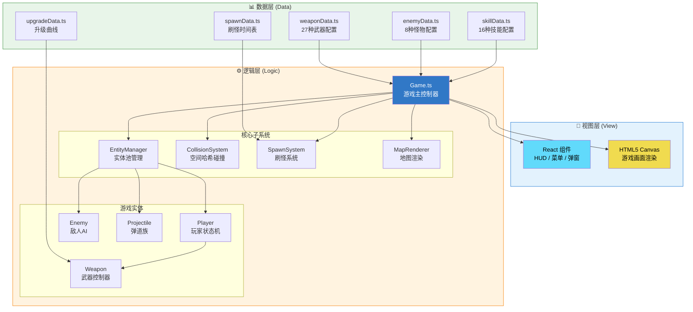
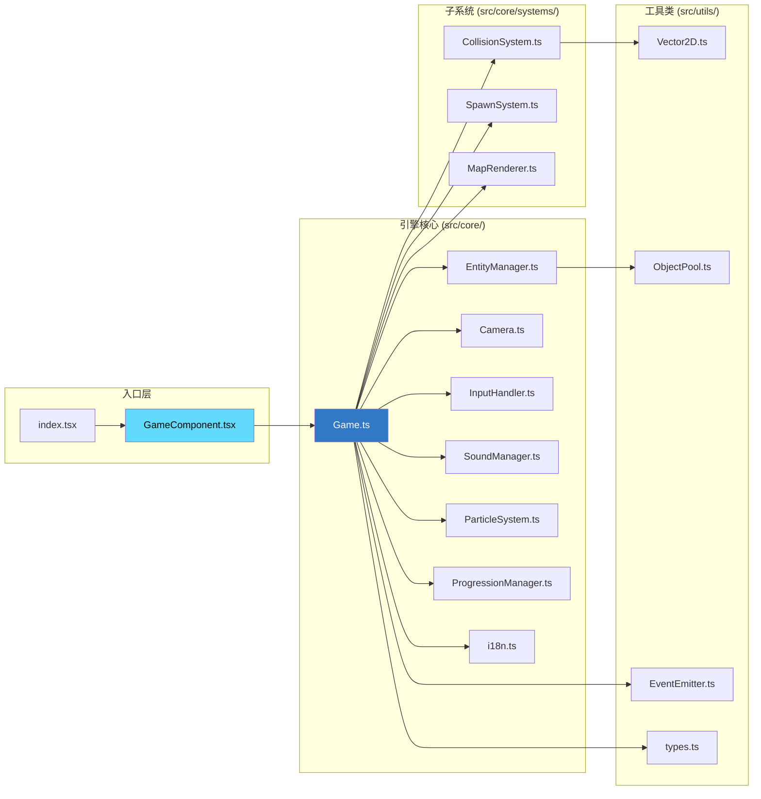
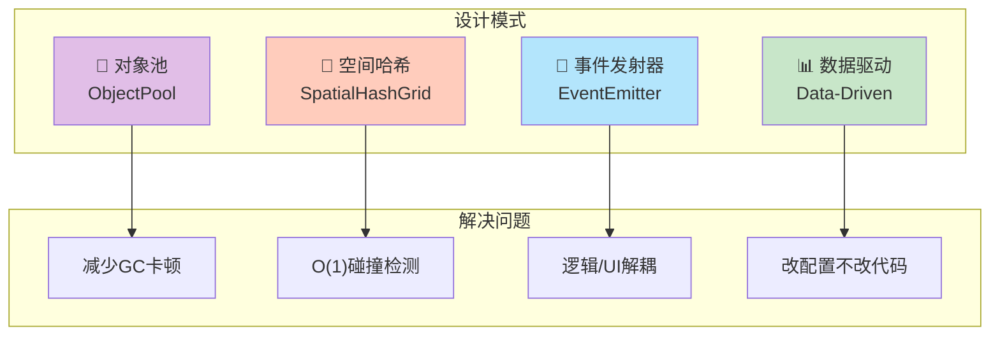

# 🏗️ 系统架构总图

> 本文档展示 Sparkle Survivors 的 Data-Logic-View (DLV) 三层架构设计。

---

## 📐 DLV 三层架构全景

---

## 🔗 核心类依赖关系

---

## 📁 目录层级映射

| 层级 | 目录 | 职责 | 文件数 |
|:---|:---|:---|:---:|
| **数据层** | `src/data/` | 纯配置，不含逻辑 | 15+ |
| **逻辑层** | `src/core/` | 游戏引擎核心 | 12 |
| **逻辑层** | `src/core/systems/` | 碰撞/刷怪/地图 | 4 |
| **逻辑层** | `src/entities/` | 游戏对象行为 | 20+ |
| **视图层** | `src/components/` | React UI 组件 | 21 |
| **工具层** | `src/utils/` | 通用工具 | 4 |

---

## 🔑 核心设计模式

---

## 🔗 相关文档

- [00-architecture-overview.md](../reverse-engineering/00-architecture-overview.md) - 架构详细分析
- [01-game-loop.md](../reverse-engineering/01-game-loop.md) - 主循环深入
- [15-core-subsystems.md](../reverse-engineering/15-core-subsystems.md) - 子系统技术细节
