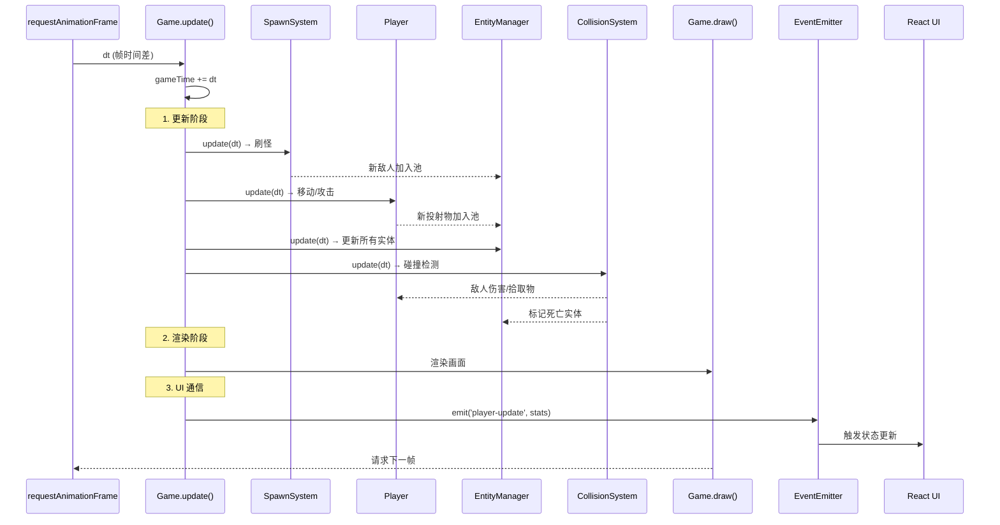
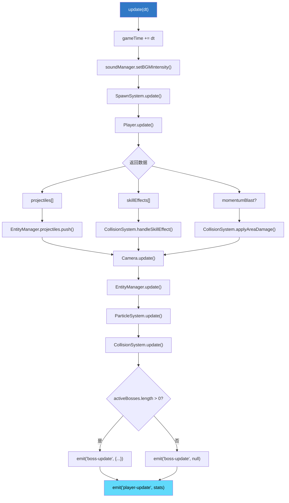
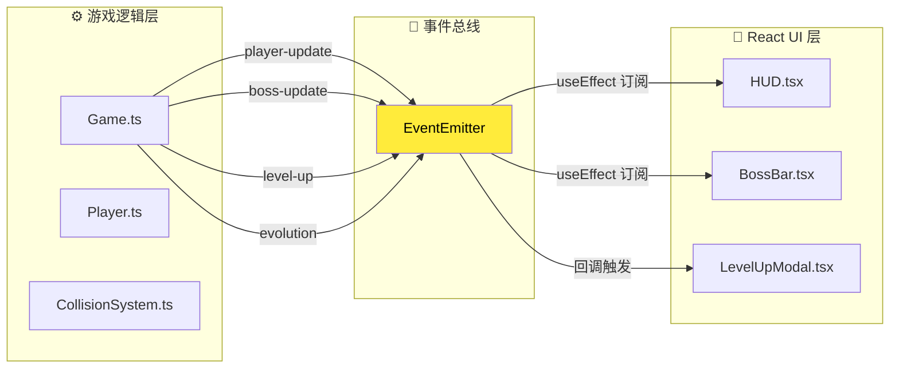
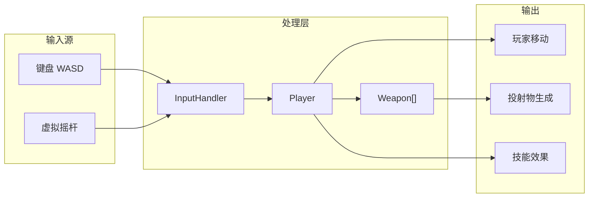
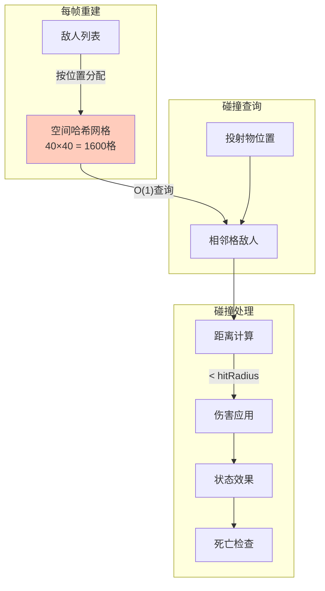

# 🔄 数据流图

> 本文档展示游戏主循环的数据流向和事件通信机制。

---

## 📐 主循环时序图

---

## 🔄 Update 阶段详细流程

---

## 📡 事件通信机制

---

## 🎯 事件类型清单

| 事件名 | 触发时机 | 数据结构 | 订阅者 |
|:---|:---|:---|:---|
| `player-update` | 玩家状态变化 | `{ hp, maxHp, xp, level, gold, ... }` | HUD |
| `boss-update` | Boss状态变化 | `{ id, name, hp, maxHp }` / `null` | BossBar |
| `level-up` | 玩家升级 | `upgradeOptions[]` | LevelUpModal |
| `evolution` | 武器进化 | `{ weaponId, evolvedId }` | EvolutionNotification |

---

## 📦 实体数据流

---

## 🔗 碰撞数据流

---

## 🔗 相关文档

- [01-game-loop.md](../reverse-engineering/01-game-loop.md) - 主循环详细分析
- [03-collision-system.md](../reverse-engineering/03-collision-system.md) - 碰撞系统深入
- [15-core-subsystems.md](../reverse-engineering/15-core-subsystems.md) - 子系统技术细节
