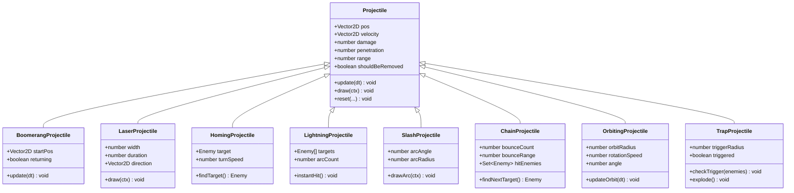
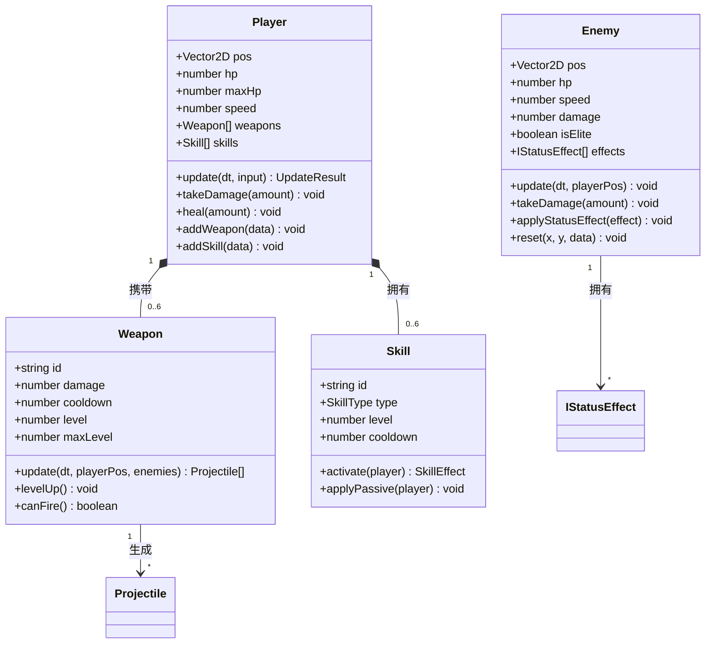
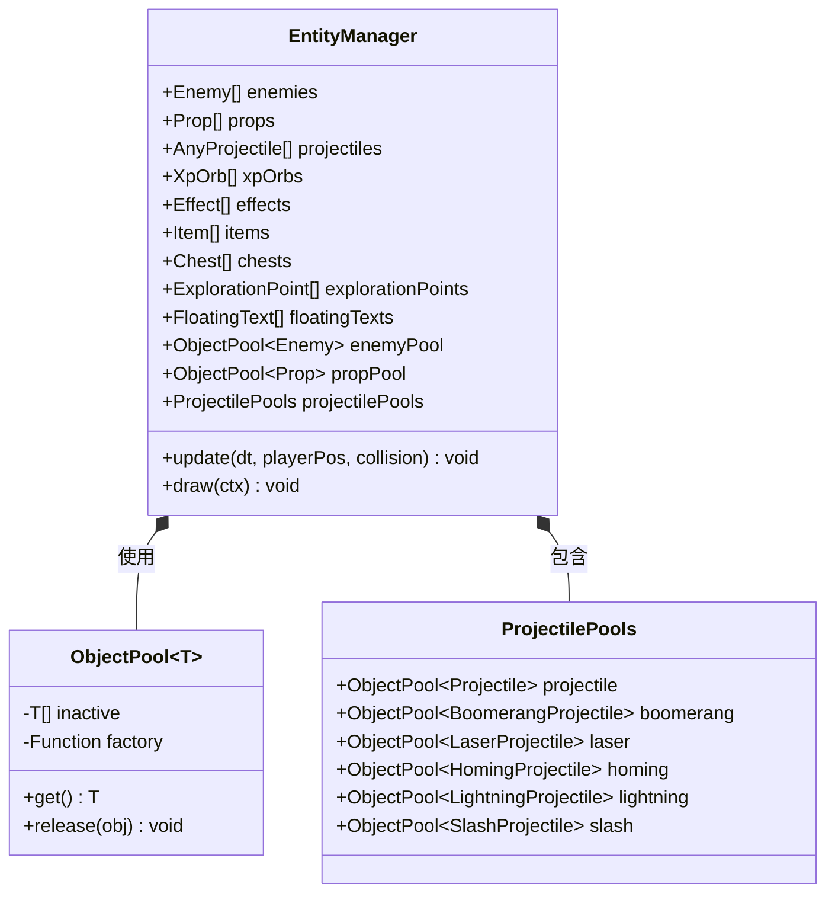
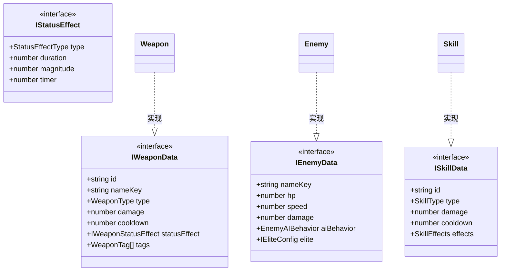

# 🔗 实体关系图

> 本文档展示游戏中所有实体类的继承关系和组合关系。

---

## 📐 投射物类继承体系

---

## 👾 核心实体类图

---

## 📦 实体管理器组成

---

## 🎮 辅助实体类

```mermaid
classDiagram
    class XpOrb {
        +Vector2D pos
        +number value
        +number size
        +string color
        +boolean absorbed
        +update(dt, playerPos) void
    }

    class Chest {
        +Vector2D pos
        +boolean opened
        +number animFrame
        +open() LootResult
    }

    class Item {
        +Vector2D pos
        +string type
        +number value
        +apply(player) void
    }

    class Prop {
        +Vector2D pos
        +number hp
        +takeDamage(amount) void
        +drop() Item[]
    }

    class ExplorationPoint {
        +Vector2D pos
        +boolean collected
        +collect(player) void
    }

    class FloatingText {
        +Vector2D pos
        +string text
        +string color
        +number lifetime
        +update(dt) void
    }

    class Particle {
        +Vector2D pos
        +Vector2D velocity
        +number lifetime
        +string color
        +update(dt) void
    }

    class AuraEffect {
        +Vector2D pos
        +number radius
        +number alpha
        +draw(ctx) void
    }

    class PulseEffect {
        +Vector2D pos
        +number maxRadius
        +number currentRadius
        +update(dt) void
    }
```

---

## 🔗 类型接口关系

---

## 🔗 相关文档

- [02-entity-management.md](../reverse-engineering/02-entity-management.md) - 实体管理详解
- [14-type-system.md](../reverse-engineering/14-type-system.md) - 类型系统定义
- [16-ui-project-structure.md](../reverse-engineering/16-ui-project-structure.md) - 项目结构概览
