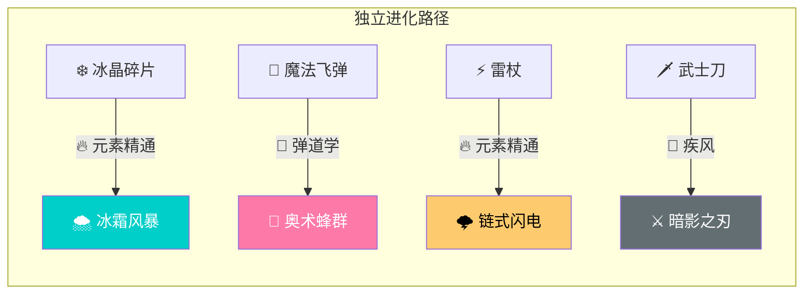
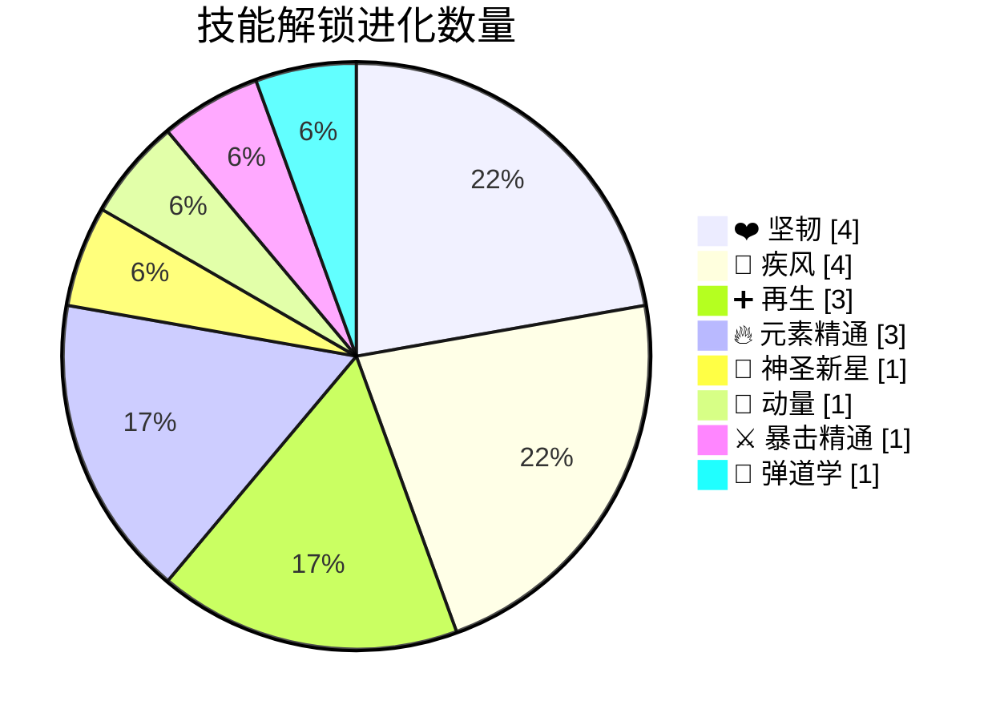
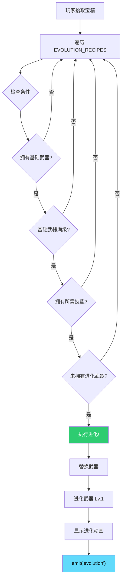
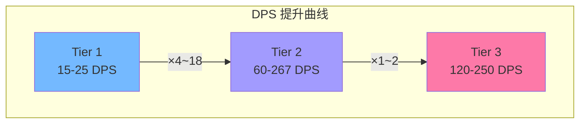

# 🔄 武器进化树

> 本文档展示 18 条武器进化路线及其技能依赖关系。

---

## 📐 武器进化全景图

```mermaid
graph LR
    subgraph Line1["🔫 物理投射线"]
        BULLET["🔫 手枪<br/>T1"] -->|"❤️ 坚韧"| GATLING["🦾 加特林<br/>T2"]
        GATLING -->|"💨 疾风"| DOOM["👹 末日炮<br/>T3"]
    end

    subgraph Line2["🥏 回旋线"]
        BOOM["🥏 回旋镖<br/>T1"] -->|"💨 疾风"| SONIC["💿 音速飞碟<br/>T2"]
        SONIC -->|"❤️ 坚韧"| VOID["🌌 虚空吞噬<br/>T3"]
    end

    subgraph Line3["🔥 火焰光环线"]
        SUN["🔥 烈阳<br/>T1"] -->|"➕ 再生"| NOVA["🌞 超新星<br/>T2"]
        NOVA -->|"➕ 再生"| BLACK["🕳️ 黑洞<br/>T3"]
    end

    subgraph Line4["🗡️ 毒系线"]
        DAGGER["🗡️ 毒匕首<br/>T1"] -->|"❤️ 坚韧"| VENOM["🐍 毒牙<br/>T2"]
        VENOM -->|"➕ 再生"| PLAGUE["☠️ 瘟疫镰刀<br/>T3"]
    end

    subgraph Line5["👻 召唤线"]
        SPIRIT["👻 灵魂宝珠<br/>T1"] -->|"🌟 神圣新星"| PHANTOM["👁️ 幻影守卫<br/>T2"]
        PHANTOM -->|"🏃 动量"| SOUL["🌀 灵魂漩涡<br/>T3"]
    end

    subgraph Line6["⛓️ 链式线"]
        CHAIN["⛓️ 链电<br/>T1"] -->|"🔥 元素精通"| SHOCK["⚡ 电击链<br/>T2"]
        SHOCK -->|"⚔️ 暴击精通"| STORM["🌩️ 风暴编织<br/>T3"]
    end

    subgraph Line7["📌 陷阱线"]
        SPIKE["📌 尖刺陷阱<br/>T1"] -->|"💨 疾风"| FROST["💎 寒霜地雷<br/>T2"]
        FROST -->|"❤️ 坚韧"| RIFT["🌑 虚空裂隙<br/>T3"]
    end

    %% T3 高亮样式
    style DOOM fill:#ff6b6b,color:#fff
    style VOID fill:#9c88ff,color:#fff
    style BLACK fill:#2d3436,color:#fff
    style PLAGUE fill:#00b894,color:#fff
    style SOUL fill:#a29bfe,color:#fff
    style STORM fill:#fdcb6e,color:#000
    style RIFT fill:#636e72,color:#fff
```

---

## 🔀 独立进化武器

---

## 🎯 技能解锁进化统计

---

## 📊 技能-进化关联表

| 技能 | 解锁数量 | 进化路线 |
|:---|:---:|:---|
| ❤️ 坚韧 | 4 | 手枪→加特林, 音速→虚空, 毒匕首→毒牙, 寒霜→虚空裂隙 |
| 💨 疾风 | 4 | 加特林→末日炮, 回旋镖→音速, 尖刺→寒霜, 武士刀→暗影 |
| ➕ 再生 | 3 | 烈阳→超新星, 超新星→黑洞, 毒牙→瘟疫镰刀 |
| 🔥 元素精通 | 3 | 链电→电击链, 冰晶→冰霜风暴, 雷杖→链式闪电 |
| 🌟 神圣新星 | 1 | 灵魂宝珠→幻影守卫 |
| 🏃 动量 | 1 | 幻影守卫→灵魂漩涡 |
| ⚔️ 暴击精通 | 1 | 电击链→风暴编织者 |
| 🎯 弹道学 | 1 | 魔法飞弹→奥术蜂群 |

---

## 🔄 进化触发流程

---

## 📈 武器Tier属性对比

---

## 🔗 相关文档

- [05-weapon-data-spec.md](../reverse-engineering/05-weapon-data-spec.md) - 武器数值规格
- [08-evolution-matrix.md](../reverse-engineering/08-evolution-matrix.md) - 进化配方详解
- [12-upgrade-paths.md](../reverse-engineering/12-upgrade-paths.md) - 升级路径数值
