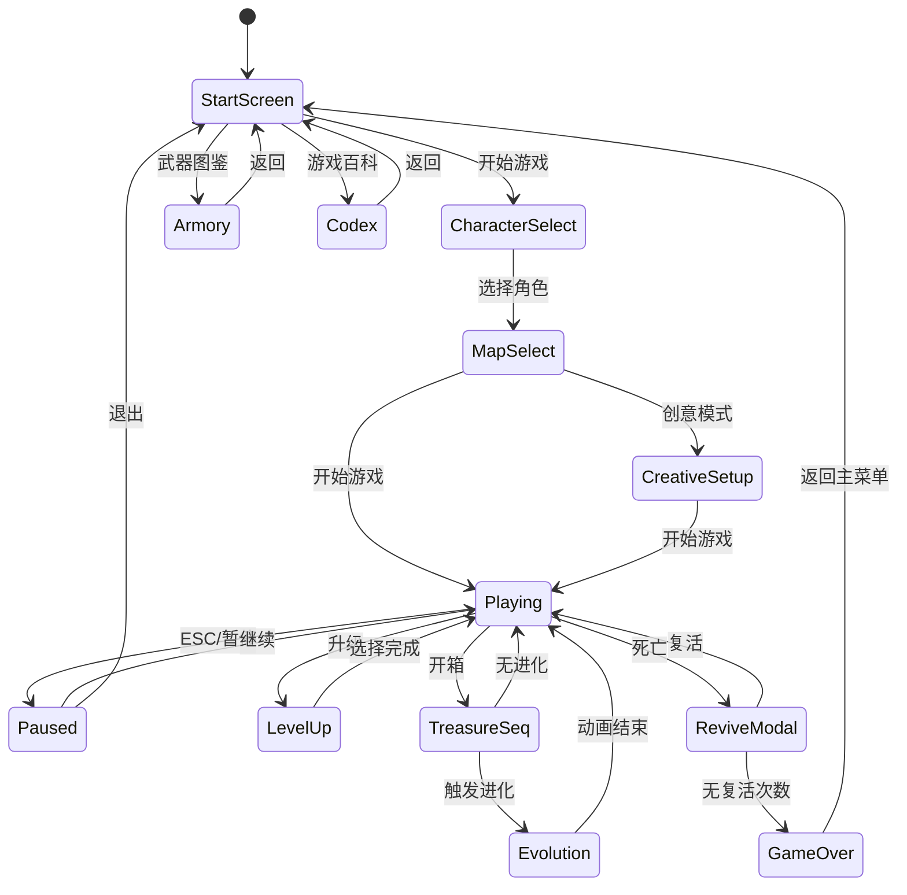
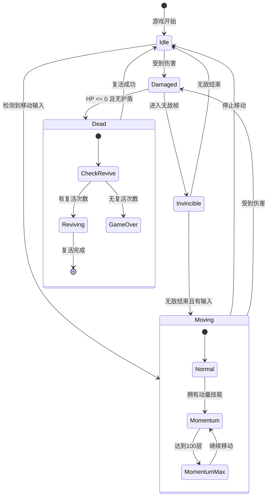
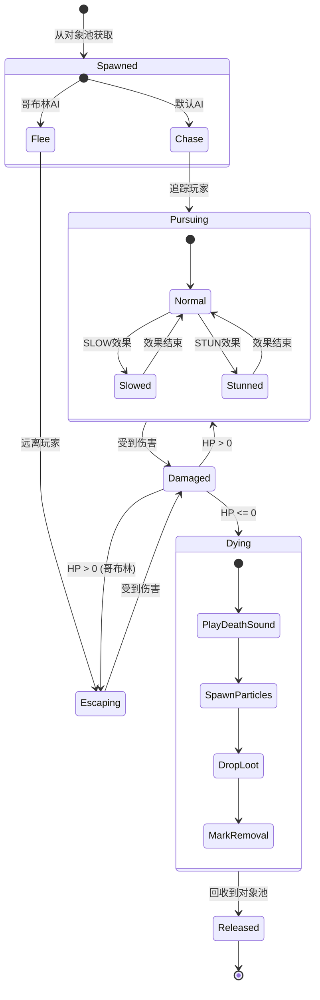
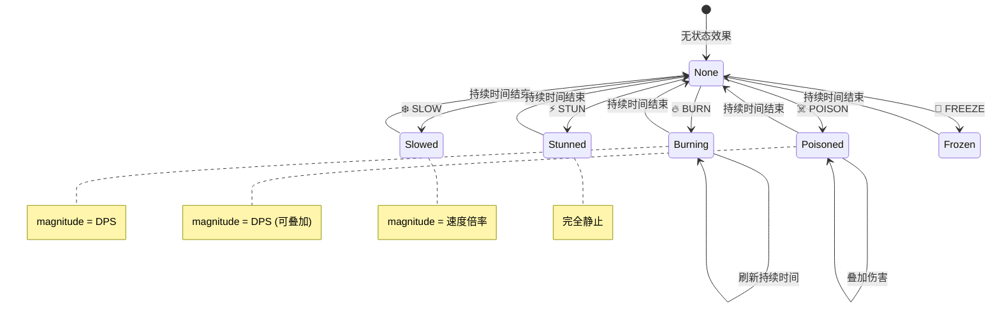
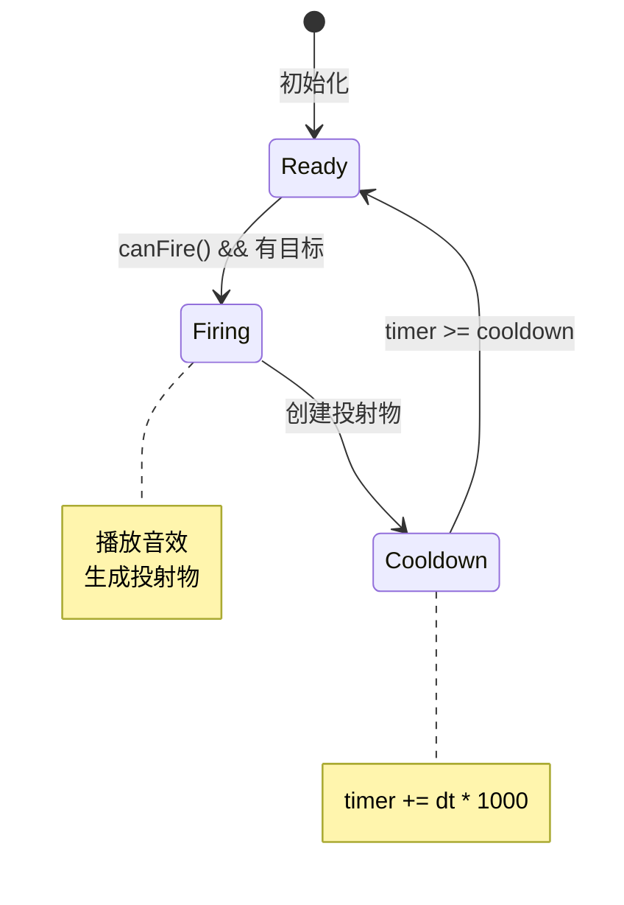
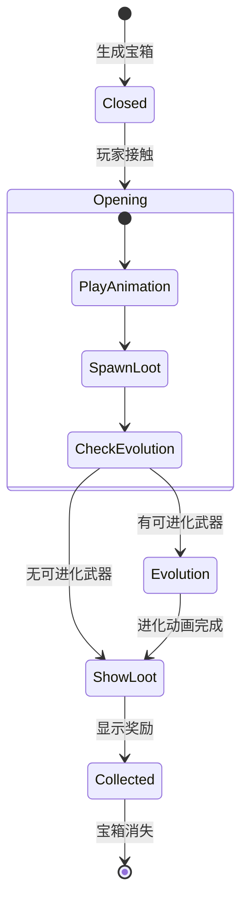
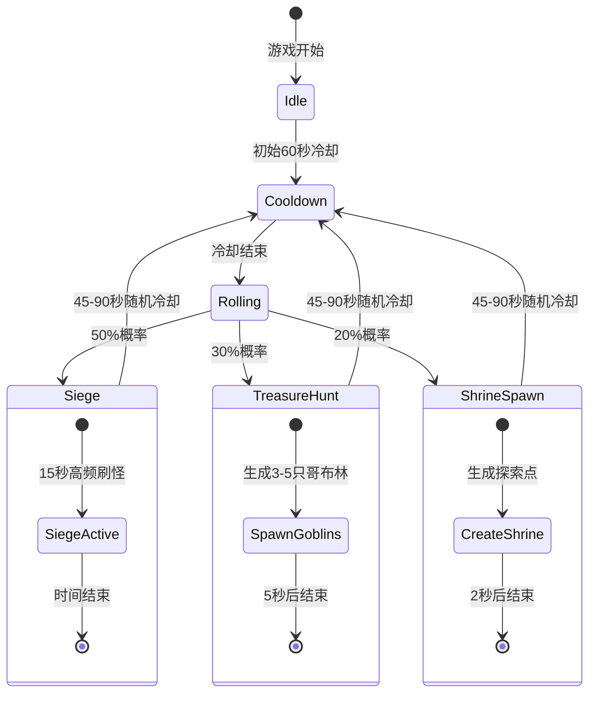

# 🔁 游戏状态机图

> 本文档展示游戏 UI 流程、玩家状态和敌人 AI 状态机。

---

## 🎮 游戏 UI 状态流转

---

## 🧙 玩家状态机

---

## 👾 敌人 AI 状态机

---

## 💥 状态效果状态机

---

## 🔫 武器冷却状态机

---

## 🎁 宝箱交互状态机

---

## 🗺️ 地图事件状态机

---

## 🔗 相关文档

- [13-player-system.md](../reverse-engineering/13-player-system.md) - 玩家系统详解
- [07-enemy-spawn-design.md](../reverse-engineering/07-enemy-spawn-design.md) - 敌人与事件设计
- [16-ui-project-structure.md](../reverse-engineering/16-ui-project-structure.md) - UI 组件结构
