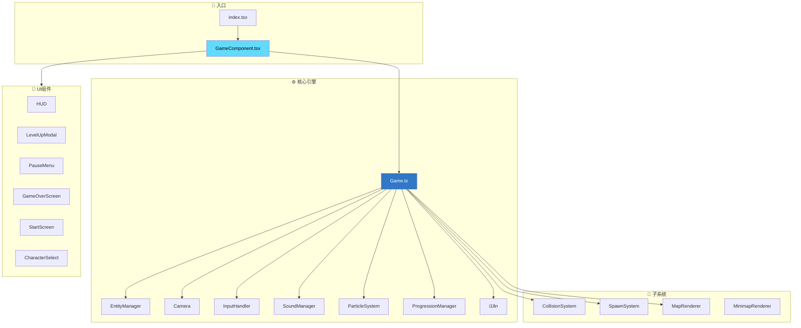
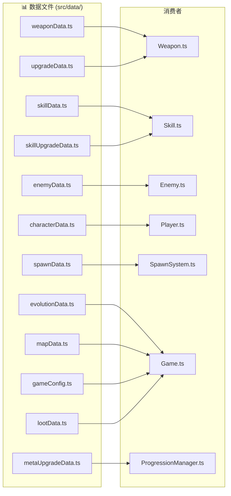
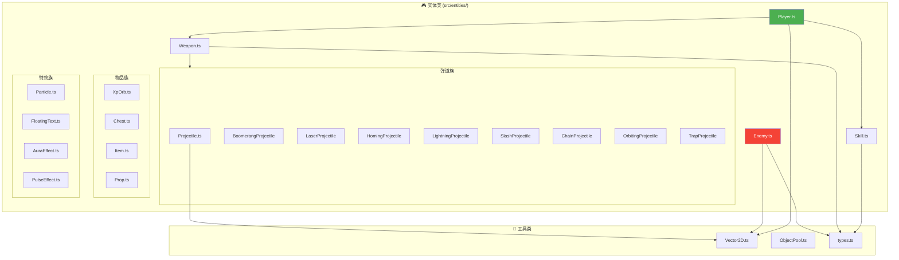
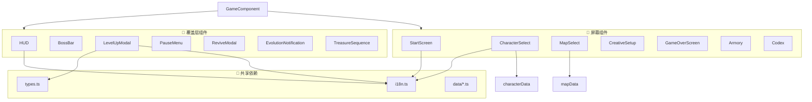
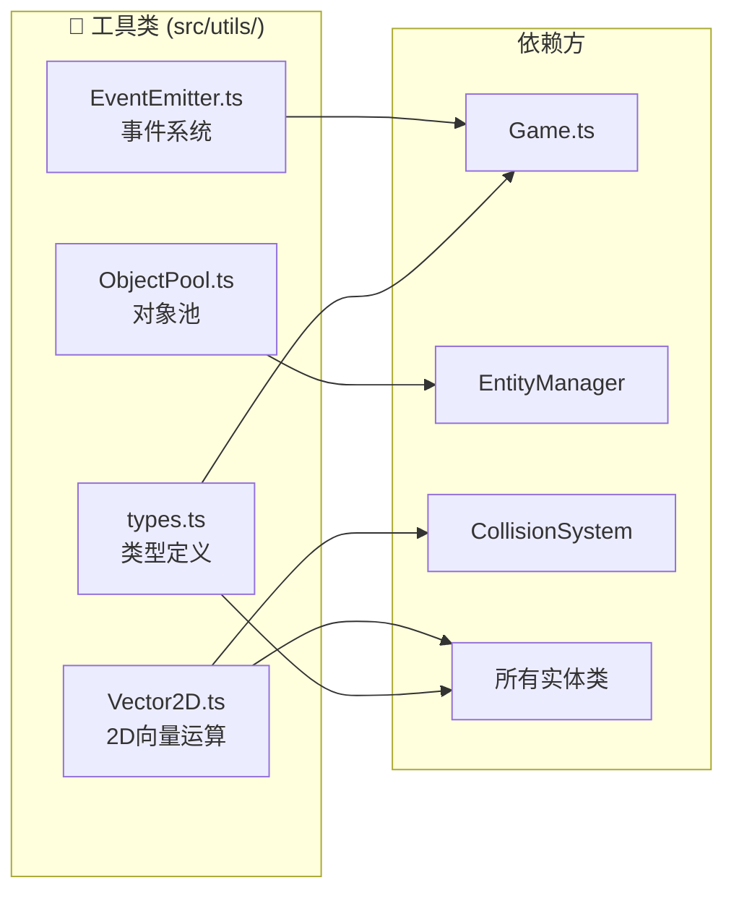

# 📦 模块依赖图

> 本文档展示 src/ 目录的模块间导入依赖关系。

---

## 📐 顶层模块依赖

---

## 📊 数据层依赖

---

## 👾 实体层依赖

---

## 🎨 UI 组件依赖

---

## 🔧 工具类依赖

---

## 📁 目录结构导入热力图

| 目录 | 被导入次数 | 主要消费者 |
|:---|:---:|:---|
| `src/data/` | 🔥🔥🔥 | Game, 所有实体类, UI组件 |
| `src/utils/` | 🔥🔥🔥 | 全项目通用 |
| `src/core/` | 🔥🔥 | GameComponent, 子系统 |
| `src/entities/` | 🔥🔥 | EntityManager, Game |
| `src/components/` | 🔥 | GameComponent |
| `src/core/systems/` | 🔥 | Game |

---

## 🔗 相关文档

- [FILE_MAP.md](../../FILE_MAP.md) - 文件功能映射
- [16-ui-project-structure.md](../reverse-engineering/16-ui-project-structure.md) - 项目结构详解
- [01-system-architecture.md](./01-system-architecture.md) - 系统架构图
