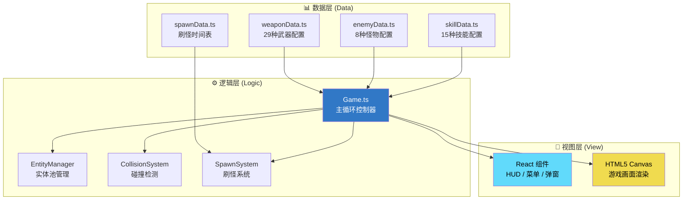
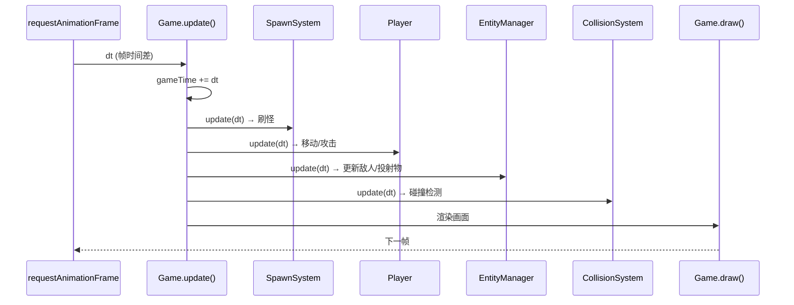

# 🎮 Sparkle Survivors 架构总览

> 本文档用于让非技术人员也能理解游戏的核心架构。

---

## 📌 一句话概括

**Sparkle Survivors 是一款采用 Data-Logic-View (DLV) 三层架构的 TypeScript/React 游戏引擎，通过数据驱动设计实现"改配置不改代码"的高可维护性。**

---

## 🏗️ 架构全景



---

## 📁 目录结构映射

| 层级 | 目录 | 职责 | 典型文件 |
|:---|:---|:---|:---|
| **数据层** | `src/data/` | 纯配置，不含逻辑 | `weaponData.ts`, `enemyData.ts` |
| **逻辑层** | `src/core/` | 游戏引擎核心 | `Game.ts`, `EntityManager.ts` |
| **逻辑层** | `src/core/systems/` | 子系统 | `CollisionSystem.ts`, `SpawnSystem.ts` |
| **逻辑层** | `src/entities/` | 游戏对象行为 | `Player.ts`, `Enemy.ts`, `Weapon.ts` |
| **视图层** | `src/components/` | React UI | `HUD.tsx`, `LevelUpModal.tsx` |
| **工具层** | `src/utils/` | 通用工具 | `ObjectPool.ts`, `Vector2D.ts` |

---

## 🔑 核心设计模式

### 1. 对象池模式 (Object Pool)
**作用**: 减少垃圾回收 (GC) 造成的卡顿

```
问题: 每帧创建/销毁数百个敌人会导致内存抖动
解决: 预先分配对象池，重复使用已"死亡"的对象
位置: EntityManager.ts → enemyPool, projectilePool
```

### 2. 空间哈希网格 (Spatial Hash Grid)
**作用**: O(1) 复杂度的碰撞检测

```
问题: 判断1000个子弹与300个敌人的碰撞 = 300,000次计算
解决: 将世界划分为100px×100px网格，只检测同格/相邻格
位置: CollisionSystem.ts → 40×40网格 = 4000×4000px 活动区域
```

### 3. 事件发射器模式 (Event Emitter)
**作用**: 解耦游戏逻辑与 UI 更新

```
位置: Game.ts → this.events
触发: game.events.emit('player-update', stats)
监听: React组件订阅事件更新状态
```

### 4. 数据驱动设计 (Data-Driven)
**作用**: 策划可直接修改配置文件调整平衡性

```
示例: 
  - 调整武器伤害 → 编辑 src/data/weaponData.ts
  - 调整刷怪频率 → 编辑 src/data/spawnData.ts
  - 无需修改任何逻辑代码
```

---

## 🔄 主循环流程



---

## 📊 关键数值概览

| 配置项 | 当前值 | 位置 |
|:---|:---:|:---|
| 敌人上限 | 300 | `SpawnSystem.ts` → `ENEMY_CAP` |
| 碰撞网格大小 | 100px | `CollisionSystem.ts` → `CELL_SIZE` |
| 碰撞网格范围 | 40×40 (4000px²) | `CollisionSystem.ts` → `GRID_COLS/ROWS` |
| 精英怪起始时间 | 300秒 (5分钟) | `SpawnSystem.ts` → `ELITE_SPAWN_START_TIME` |
| 精英怪概率 | 10% | `SpawnSystem.ts` → `ELITE_SPAWN_CHANCE` |
| 道具刷新间隔 | 15秒 | `SpawnSystem.ts` → `ITEM_SPAWN_INTERVAL` |
| 可破坏物刷新间隔 | 2秒 | `SpawnSystem.ts` → `PROP_SPAWN_INTERVAL` |
| 探索点刷新间隔 | 60秒 | `SpawnSystem.ts` → `EXPLORATION_SPAWN_INTERVAL` |

---

## 🔗 文档导航

| # | 文档 | 描述 |
|---|------|------|
| 00 | [架构总览](./00-architecture-overview.md) | DLV架构、设计模式、核心数值 |
| 01 | [游戏主循环](./01-game-loop.md) | Game.ts 深度分析 |
| 02 | [实体管理](./02-entity-management.md) | 对象池与生命周期 |
| 03 | [碰撞系统](./03-collision-system.md) | 空间哈希与伤害计算 |
| 04 | [刷怪系统](./04-spawn-system.md) | 时间轴与事件系统 |
| 05 | [武器数值规格](./05-weapon-data-spec.md) | 29种武器完整参数 |
| 06 | [技能数值规格](./06-skill-data-spec.md) | 15种技能完整参数 |
| 07 | [敌人与刷怪设计](./07-enemy-spawn-design.md) | 8种敌人 + 刷怪时间表 |
| 08 | [进化矩阵](./08-evolution-matrix.md) | 18条进化路线图 |
| 09 | [全局游戏配置](./09-game-config.md) | 经验曲线、系统限制 |

---

## ✅ 已确认依赖

| 模块 | 技术实现 | 详情 |
|:---|:---|:---|
| `SoundManager.ts` | Web Audio API | 程序化合成复古音效，无需外部音频文件 |
| `ProgressionManager.ts` | localStorage | 存储键 `sparkle_survivors_save_v1`，JSON 序列化 |
| `i18n.ts` | fetch + localStorage | 动态加载 `./locales/{lang}.json`，语言偏好存于 `survivor_game_lang` |

---

## 📝 版本信息

- **分析日期**: 2026-01-10
- **项目版本**: v2.0
- **文件总数**: ~98 个 TypeScript/TSX 文件
