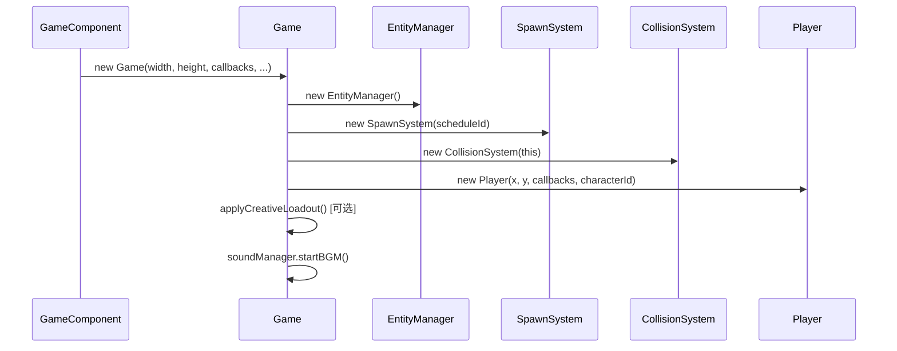
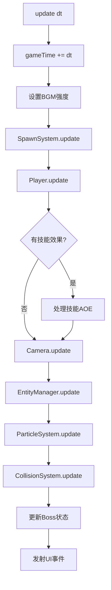
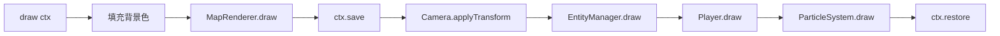
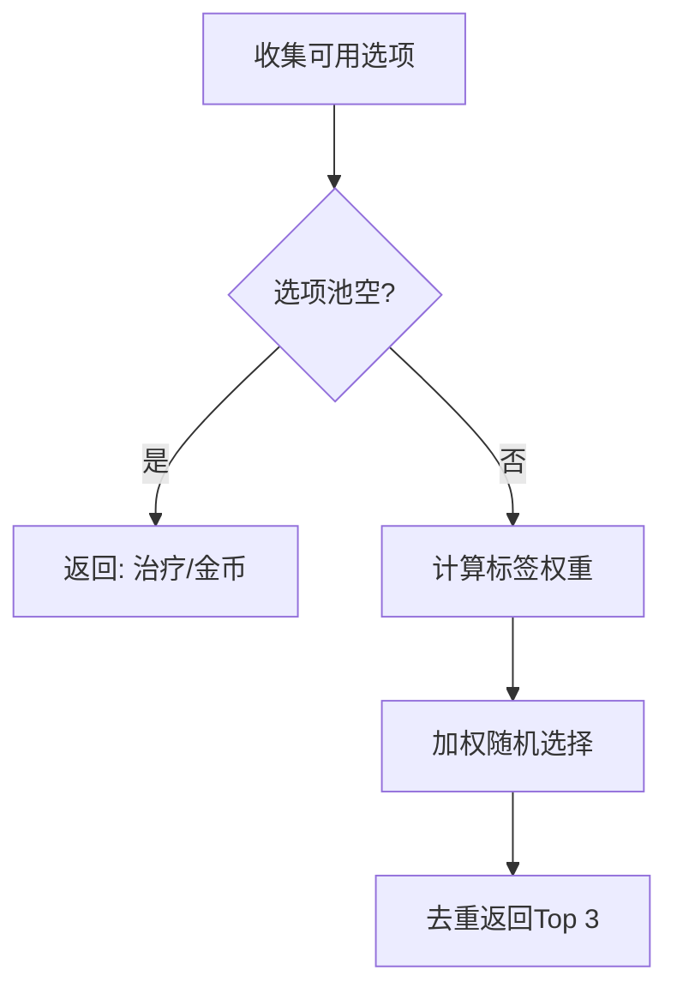

# 🔄 游戏主循环文档

> 本文档详细分析 Game.ts 的主循环架构和核心流程。

---

## 📌 概述

**Game.ts** 是整个游戏引擎的核心控制器，负责：
- 初始化所有子系统
- 驱动每帧的 update/draw 循环
- 协调 UI 与游戏逻辑的通信

---

## 🏗️ 系统初始化流程



### 构造函数参数

| 参数 | 类型 | 说明 |
|:---|:---|:---|
| `width` | number | 画布宽度 |
| `height` | number | 画布高度 |
| `onLevelUp` | () => void | 升级回调，通知 UI 显示升级弹窗 |
| `onChestOpenStart` | (chest) => void | 宝箱动画回调 |
| `onEvolution` | (weapon) => void | 武器进化回调 |
| `soundManager` | SoundManager | 音频管理器 |
| `characterId` | string | 角色ID (如 'KNIGHT') |
| `mapId` | string | 地图ID (如 'FOREST') |
| `initialLoadout?` | CreativeLoadout | 创造模式初始装备 |

---

## 🔄 主更新循环



### update(dt) 详细步骤

```typescript
update(dt: number) {
    // 1. 更新游戏时间
    this.gameTime += dt;

    // 2. 根据游戏时长调整BGM强度 (0-5分钟渐进)
    const intensity = Math.min(1.0, this.gameTime / 300);
    this.soundManager.setBGMIntensity(intensity);

    // 3. 刷怪系统更新
    this.spawnSystem.update(dt);

    // 4. 玩家更新 (移动、攻击)，返回新产生的投射物和技能效果
    const { projectiles, skillEffects, momentumBlast } = 
        this.player.update(dt, this.input, this.entityManager.enemies, this.entityManager.projectilePools);
    
    // 5. 将新投射物加入管理列表
    this.entityManager.projectiles.push(...projectiles);
    
    // 6. 处理技能效果
    skillEffects.forEach(effect => this.collisionSystem.handleSkillEffect(effect));

    // 7. 处理动量技能的爆发冲击
    if (momentumBlast) {
        this.collisionSystem.applyAreaDamage(this.player.pos, momentumBlast.radius, momentumBlast.damage);
        this.entityManager.effects.push(new PulseEffect(this.player.pos, momentumBlast.radius));
    }

    // 8. 相机跟随
    this.camera.update(dt, this.player.pos);

    // 9. 实体管理器更新 (敌人、投射物、道具等)
    this.entityManager.update(dt, this.player.pos, this.collisionSystem, (enemy) => {
        if (enemy.isElite) this.removeActiveBoss(enemy);
    });

    // 10. 粒子系统更新
    this.particleSystem.update(dt);

    // 11. 碰撞系统更新
    this.collisionSystem.update(dt);

    // 12. Boss状态通知
    if (this.activeBosses.length > 0) {
        const boss = this.activeBosses[0];
        this.events.emit('boss-update', { id, name, hp, maxHp });
    } else {
        this.events.emit('boss-update', null);
    }
}
```

---

## 🎨 渲染流程



### 渲染层级 (从下到上)

1. **背景层**: 地图底色
2. **地图层**: 地砖、装饰物
3. **道具层**: 可破坏物、探索点
4. **拾取物层**: 经验球、道具、宝箱
5. **特效层**: 光环、脉冲
6. **敌人层**: 所有敌人
7. **投射物层**: 所有武器投射物
8. **玩家层**: 玩家角色
9. **粒子层**: 爆炸、伤害粒子
10. **UI层**: 飘字、伤害数字

---

## 📡 事件系统

Game.ts 使用 EventEmitter 模式与 React UI 通信：

| 事件名 | 触发时机 | 数据 |
|:---|:---|:---|
| `player-update` | 玩家状态变化 | `{ hp, maxHp, xp, level, gold, ... }` |
| `boss-update` | Boss状态变化 | `{ id, name, hp, maxHp }` 或 `null` |

### 使用示例

```typescript
// Game.ts 发射事件
this.events.emit('player-update', { hp: player.hp, maxHp: player.maxHp });

// React组件订阅
useEffect(() => {
    game.events.on('player-update', (stats) => setPlayerStats(stats));
    return () => game.events.off('player-update', handler);
}, []);
```

---

## 🎮 升级系统

### 生成升级选项 (generateUpgradeOptions)



### 权重计算规则

| 选项类型 | 基础权重 | 加成条件 |
|:---|:---:|:---|
| 新武器 | 1 | 每个匹配标签 +1 |
| 武器升级 | 1 + 2 | 升级自有武器天然加权 |
| 新技能 | 1 | 特定技能有额外加权 |
| 技能升级 | 1 | - |

---

## ✅ 已确认实现

| 项目 | 实现详情 |
|:---|:---|
| 游戏循环驱动 | `GameComponent.tsx` 第 221-262 行使用 `requestAnimationFrame(gameLoop)` |
| 暂停/恢复控制 | React 通过 `gameStateRef.current === 'playing'` 判断是否调用 `game.update(dt)` |
| 帧时间限制 | `dt = (timestamp - lastTime) / 1000`，上限 0.1s 防止跳帧 |

---

## 📝 配置文件位置

```
src/core/Game.ts                    # 主游戏类
src/GameComponent.tsx               # React 宿主组件
src/utils/EventEmitter.ts           # 事件发射器
```
