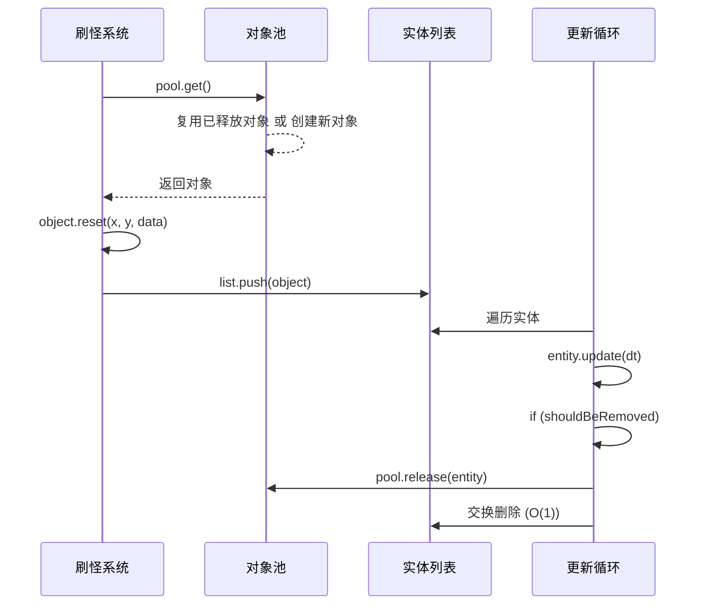
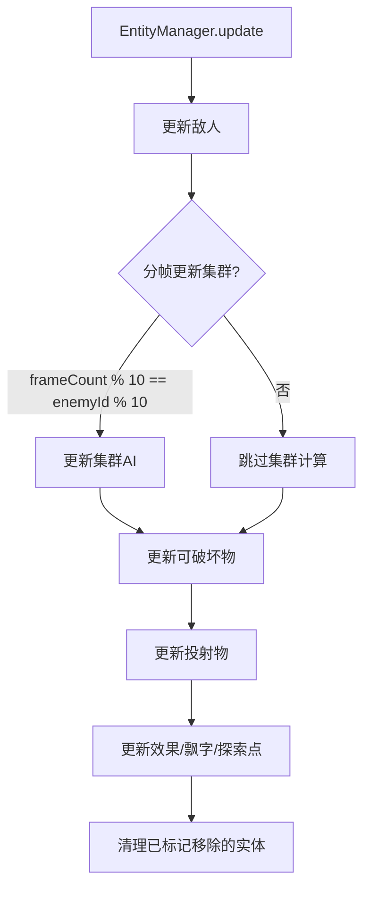

# 📦 实体管理系统文档

> 本文档详细分析 EntityManager.ts 的对象池机制和实体生命周期管理。

---

## 📌 概述

**EntityManager** 是所有游戏实体的中央管理器，负责：
- 对象池化 (Object Pooling) 减少GC
- 实体更新与移除
- 绘制顺序控制

---

## 📊 管理的实体类型

| 实体 | 数组 | 是否池化 | 说明 |
|:---|:---|:---:|:---|
| 敌人 | `enemies` | ✅ | enemyPool |
| 可破坏物 | `props` | ✅ | propPool |
| 投射物 | `projectiles` | ✅ | 多个专用池 |
| 经验球 | `xpOrbs` | ❌ | 数量少，无需池化 |
| 效果 | `effects` | ❌ | 光环、脉冲等 |
| 道具 | `items` | ❌ | 药水、金币 |
| 宝箱 | `chests` | ❌ | 需要动画状态 |
| 探索点 | `explorationPoints` | ❌ | 数量极少 |
| 飘字 | `floatingTexts` | ❌ | 纯UI效果 |

---

## 🏊 对象池机制

### 池类型

| 池 | 对象类型 | 用途 |
|:---|:---|:---|
| `enemyPool` | Enemy | 所有敌人 |
| `propPool` | Prop | 木箱、桶 |
| `particlePool` | Particle | 粒子效果 |
| `projectilePool` | Projectile | 普通投射物 |
| `boomerangPool` | BoomerangProjectile | 回旋镖 |
| `laserPool` | LaserProjectile | 激光 |
| `homingPool` | HomingProjectile | 追踪弹 |
| `lightningPool` | LightningProjectile | 闪电 |
| `slashPool` | SlashProjectile | 斩击 |

### 池工作原理



### 交换删除算法

```typescript
// 传统删除: splice(i, 1) → O(n)
// 交换删除: O(1)
if (enemy.shouldBeRemoved) {
    pool.release(enemy);
    const last = enemies[enemies.length - 1];
    enemies[i] = last;    // 用最后一个填充当前位置
    enemies.pop();        // 删除最后一个
    // 不执行 i++，因为当前位置现在是新元素
}
```

---

## 🔄 更新流程

### 帧更新优化



### 分帧集群更新

```typescript
const updateStride = 10;  // 每10帧更新一轮
const frameMod = frameCount % updateStride;

for (enemy of enemies) {
    // 只有 ID % 10 == 当前帧余数 的敌人更新集群
    const shouldUpdateFlocking = (enemy.id % updateStride) === frameMod;
    
    if (shouldUpdateFlocking) {
        neighbors = collisionSystem.getNeighbors(enemy.pos, 50);
    }
    
    enemy.update(dt, playerPos, neighbors);
}
```

**效果**: 集群AI计算量减少 90%，同时保持视觉平滑

---

## 🎨 绘制顺序

```typescript
draw(ctx: CanvasRenderingContext2D) {
    // 1. 最底层: 可破坏物
    this.props.forEach(p => p.draw(ctx));
    
    // 2. 探索点
    this.explorationPoints.forEach(p => p.draw(ctx));
    
    // 3. 拾取物层
    this.xpOrbs.forEach(o => o.draw(ctx));
    this.items.forEach(i => i.draw(ctx));
    this.chests.forEach(c => c.draw(ctx));
    
    // 4. 特效层
    this.effects.forEach(e => e.draw(ctx));
    
    // 5. 敌人层 (玩家在Game中单独绘制)
    this.enemies.forEach(e => e.draw(ctx));
    
    // 6. 投射物层
    this.projectiles.forEach(p => p.draw(ctx));
    
    // 7. 最顶层: 飘字
    this.floatingTexts.forEach(t => t.draw(ctx));
}
```

---

## 📊 投射物池聚合接口

```typescript
interface ProjectilePools {
    projectile: ObjectPool<Projectile>;
    boomerang: ObjectPool<BoomerangProjectile>;
    laser: ObjectPool<LaserProjectile>;
    homing: ObjectPool<HomingProjectile>;
    lightning: ObjectPool<LightningProjectile>;
    slash: ObjectPool<SlashProjectile>;
}
```

**用途**: 传递给 `Player.update()` 让武器直接从池中获取投射物

---

## ✅ 已确认实现

| 项目 | 实现详情 |
|:---|:---|
| 实体池类型 | 6稭：`Projectile`, `Boomerang`, `Laser`, `Homing`, `Lightning`, `Slash` |
| 未池化投射物 | `ChainProjectile`, `OrbitingProjectile`, `TrapProjectile` 直接 `new` 创建 |
| 原因 | 这三类弹道生成频率较低，不需要对象池优化 |

---

## 📝 配置文件位置

```
src/core/EntityManager.ts   # 实体管理器主文件
src/utils/ObjectPool.ts     # 对象池实现
```
