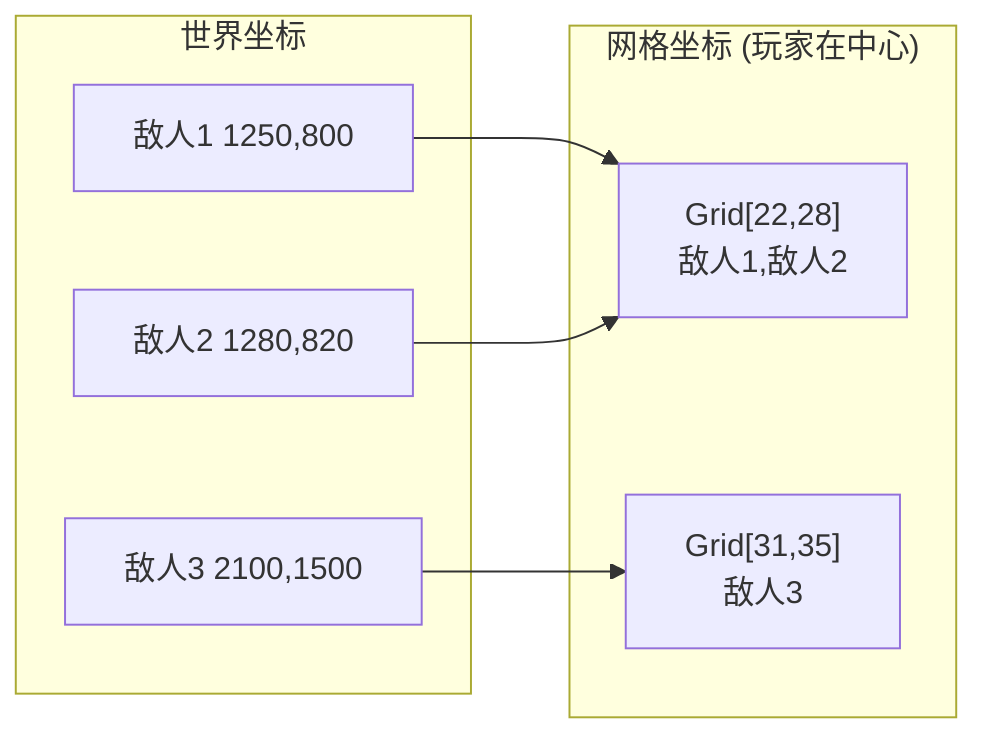
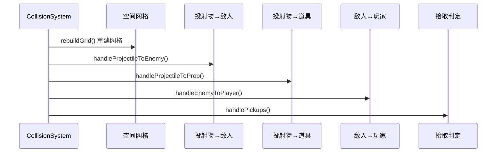
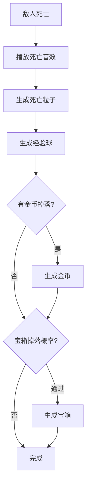

# 💥 碰撞系统文档

> 本文档详细分析 CollisionSystem.ts 的空间哈希算法和碰撞处理逻辑。

---

## 📌 概述

**CollisionSystem** 是游戏中最关键的性能组件，负责：
- 高效的空间碰撞检测 (O(1) 查询)
- 伤害计算与状态效果应用
- 元素反应系统
- 拾取判定

---

## 🗺️ 空间哈希网格

### 网格参数

| 参数 | 值 | 说明 |
|:---|:---:|:---|
| `CELL_SIZE` | 100px | 单个网格单元大小 |
| `GRID_COLS` | 40 | 列数 |
| `GRID_ROWS` | 40 | 行数 |
| 总覆盖面积 | 4000×4000px | 以玩家为中心的活动区域 |

### 工作原理



### 坐标转换公式

```
玩家始终位于网格中心 [20, 20]

col = floor((enemy.x - player.x) / 100) + 20
row = floor((enemy.y - player.y) / 100) + 20

网格索引 = row × 40 + col
```

---

## 🔄 碰撞检测流程

### 每帧更新



### 网格查询算法

```typescript
queryGrid(x: number, y: number, radius: number, out: Enemy[]) {
    // 1. 计算查询范围对应的网格坐标
    let startCol = floor((x - radius - player.x) / CELL_SIZE) + HALF_COLS;
    let endCol   = floor((x + radius - player.x) / CELL_SIZE) + HALF_COLS;
    let startRow = floor((y - radius - player.y) / CELL_SIZE) + HALF_ROWS;
    let endRow   = floor((y + radius - player.y) / CELL_SIZE) + HALF_ROWS;
    
    // 2. 限制在网格边界内
    startCol = clamp(startCol, 0, GRID_COLS - 1);
    // ...
    
    // 3. 收集范围内的所有敌人
    for (row = startRow; row <= endRow; row++) {
        for (col = startCol; col <= endCol; col++) {
            out.push(...grid[row * GRID_COLS + col]);
        }
    }
}
```

---

## ⚔️ 投射物碰撞处理

### 按投射物类型分类

| 类型 | 碰撞检测方式 | 特殊处理 |
|:---|:---|:---|
| 普通投射物 | 圆形碰撞 | 穿透计数 |
| 激光 | 线段-圆形相交 | 即时命中所有 |
| 闪电/斩击 | 圆形范围 | 即时命中所有 |
| 链式 | 圆形碰撞 | 命中后弹跳寻找下一目标 |
| 环绕 | 圆形碰撞 | 冷却时间内同一敌人不重复计算 |
| 陷阱 | 触发半径 | 触发后爆炸AOE |

### 穿透机制

```
命中敌人:
  penetration--
  hitEnemies.add(enemy.id)  // 防止重复命中
  
  if (penetration <= 0) {
    shouldBeRemoved = true
  }
```

---

## 🔥 元素反应系统

### 过载 (Overload): 雷 + 火

```
条件: 闪电攻击命中正在燃烧的敌人

效果:
  - 2倍伤害
  - 80px范围AOE爆炸
  - 爆炸对周围敌人造成 50% 伤害
  - 显示 "OVERLOAD!" 飘字
```

### 热胀冷缩 (Thermal Shock): 冰 + 火

```
条件: 冰系攻击命中正在燃烧的敌人

效果:
  - 3倍伤害
  - 蒸汽粒子特效
  - 显示 "THERMAL SHOCK!" 飘字
```

---

## 🎯 拾取系统

### 拾取范围

| 拾取物 | 拾取距离 | 效果 |
|:---|:---:|:---|
| 经验球 | 球体大小 + 玩家大小/2 + 50 | 获得经验 |
| 道具 | 道具大小/2 + 玩家大小/2 | 应用道具效果 |
| 宝箱 | 宝箱大小/2 + 玩家大小/2 | 触发开箱动画 |
| 探索点 | 探索点大小 + 玩家大小 | 治疗 + 经验 + 金币 |

### 探索点奖励

```
治疗: 100% 最大生命
经验: 500 XP
金币: 250
```

---

## 💀 敌人击败处理



---

## 🛡️ 伤害计算公式

```typescript
applyDamageToEnemy(e: Enemy, damage: number, statusEffect?, tags: WeaponTag[] = []) {
    // 1. 检查元素反应
    if (tags.includes('LIGHTNING') && e.isBurning()) {
        // Overload: 2x damage + AOE
    } else if (tags.includes('ICE') && e.isBurning()) {
        // Thermal Shock: 3x damage
    } else {
        // 普通伤害
        e.takeDamage(damage);
    }
    
    // 2. 应用状态效果
    if (statusEffect) {
        const modified = {
            ...statusEffect,
            duration: statusEffect.duration * player.statusEffectDurationMultiplier
        };
        e.applyStatusEffect(modified);
    }
    
    // 3. 检查击杀
    if (wasAlive && e.shouldBeRemoved) {
        onEnemyDefeated(e);
    }
}
```

---

## 📊 性能优化要点

| 优化项 | 技术 | 效果 |
|:---|:---|:---|
| 空间哈希 | 固定大小网格 | O(1) 查询 |
| 重用数组 | `_queryResults` 共享 | 减少GC |
| 重用向量 | `_scratchVec` 共享 | 减少对象分配 |
| 网格重置 | 只清空长度不重分配 | 保持数组容量 |
| 手动循环 | for 代替 forEach | 更快迭代 |

---

## ✅ 已确认实现

| 项目 | 实现位置 | 详情 |
|:---|:---|:---|
| 状态效果调整 | `CollisionSystem.applyDamageToEnemy()` | `duration * player.statusEffectDurationMultiplier` |
| 暴击判定 | `Player.ts` 第 414 行 | `calculateCritDamage()` 在 Player 层执行，非 CollisionSystem |

---

## 📝 配置文件位置

```
src/core/systems/CollisionSystem.ts   # 碰撞系统主文件
src/utils/Vector2D.ts                 # 向量运算工具
```
