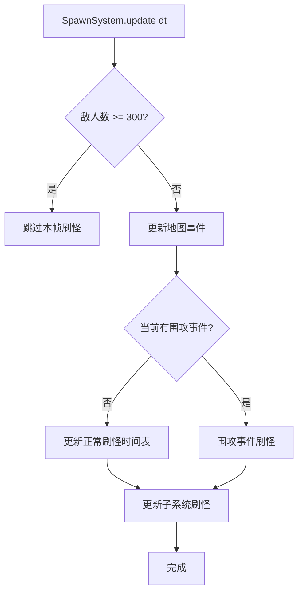
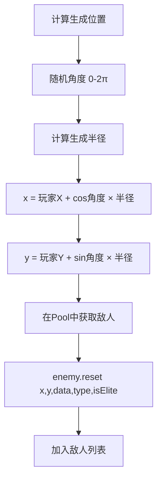
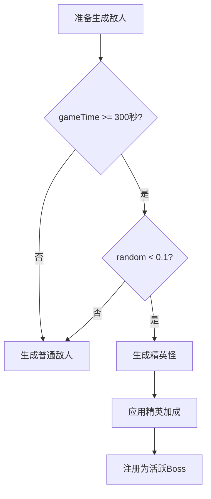

# ⏰ 刷怪系统文档

> 本文档详细分析 SpawnSystem.ts 的刷怪时间表和事件系统。

---

## 📌 概述

**SpawnSystem** 控制游戏中所有实体的生成，包括：
- 敌人波次刷新
- 随机地图事件
- 道具/宝箱/探索点生成

---

## 📊 核心参数

| 参数 | 值 | 说明 |
|:---|:---:|:---|
| `ENEMY_CAP` | 300 | 敌人数量上限，防止卡顿 |
| `ELITE_SPAWN_START_TIME` | 300秒 | 精英怪开始生成时间 |
| `ELITE_SPAWN_CHANCE` | 10% | 每只敌人成为精英的概率 |
| `ITEM_SPAWN_INTERVAL` | 15秒 | 道具刷新间隔 |
| `PROP_SPAWN_INTERVAL` | 2秒 | 可破坏物刷新间隔 |
| `EXPLORATION_SPAWN_INTERVAL` | 60秒 | 探索点刷新间隔 |

---

## 🔄 刷怪流程



---

## 📅 刷怪时间表机制

### 数据结构

```typescript
interface SpawnEvent {
    time: number;      // 触发时间(秒)
    enemyType: string; // 敌人类型ID
    rate: number;      // 刷怪间隔(毫秒)
}
```

### 时间表解析

```
时间表 = [
    { time: 0, enemyType: 'SLIME', rate: 800 },
    { time: 30, enemyType: 'SLIME', rate: 600 },
    ...
]

当 gameTime >= event.time 时:
  将该敌人类型加入刷怪管理器
  设置其刷新频率 = event.rate
```

### 累积刷怪

```
每帧:
  timer += dt × 1000 (转毫秒)
  
  if (timer >= rate) {
    amountToSpawn = floor(timer / rate)
    for (0..amountToSpawn) {
      spawnEnemy(type, maybeElite)
    }
    timer = timer % rate
  }
```

---

## 🎪 地图事件系统

### 事件类型

| 事件 | 触发概率 | 持续时间 | 效果 |
|:---|:---:|:---:|:---|
| 🔴 围攻 | 50% | 15秒 | 单一类型高频刷怪 |
| 💰 宝藏狩猎 | 30% | 5秒 | 生成3-5只宝藏哥布林 |
| 💠 圣殿降临 | 20% | 2秒 | 玩家附近生成探索点 |

### 事件触发间隔

```
初始冷却: 60秒
事件结束后冷却: 45-90秒 (随机)
```

### 围攻事件敌人类型

| 游戏时间 | 围攻敌人 |
|:---:|:---|
| 0-2分钟 | 🦇 蝙蝠 |
| 2-5分钟 | 🕷️ 蜘蛛 |
| 5分钟+ | 👻 幽灵 |

### 围攻刷怪频率

```
每帧刷怪概率 = dt × 10

示例 (60fps, dt ≈ 0.0167):
  每帧概率 = 16.7%
  平均每秒刷怪 ≈ 10只
```

---

## 🎯 敌人生成位置



### 生成距离

| 实体类型 | 距离公式 |
|:---|:---|
| 敌人 | max(屏幕宽, 屏幕高) / 2 + 50 |
| 可破坏物 | max(屏幕宽, 屏幕高) / 2 + 100 |
| 道具 | random() × (屏幕宽/3) + 100 |
| 宝箱 | 玩家位置 + 80 |
| 探索点(远) | 800 + random() × 700 |
| 探索点(近) | 300 + random() × 200 |

---

## 📦 子系统刷新

### 道具刷新

```
间隔: 15秒
类型: HEALTH_POTION
位置: 玩家周围随机
```

### 可破坏物刷新

```
间隔: 2秒
类型: 50% CRATE, 50% BARREL
位置: 屏幕边缘外
```

### 探索点刷新

```
间隔: 60秒
条件: 当前探索点数量 < 2
位置: 远离玩家 (800-1500px)
```

---

## 🔄 精英怪机制



---

## 📊 刷怪频率计算器

### 公式

```
每秒刷怪数 = 1000 / rate(ms)
每分钟刷怪数 = 60000 / rate(ms)
```

### 常见数值

| rate(ms) | 每秒 | 每分钟 |
|:---:|:---:|:---:|
| 300 | 3.33 | 200 |
| 500 | 2.00 | 120 |
| 800 | 1.25 | 75 |
| 1000 | 1.00 | 60 |
| 1500 | 0.67 | 40 |
| 3000 | 0.33 | 20 |
| 5000 | 0.20 | 12 |

---

## ✅ 已确认实现

| 项目 | 实现详情 |
|:---|:---|
| 宝箱数据 | `chestData.ts` 定义宝箱动画和帧数据 |
| 地图事件公告 | 使用 `i18nManager.t()` 翻译 |
| 围攻事件敌人类型 | 固定使用当前地图生成表中的敌人类型，非动态选择 |

---

## 📝 配置文件位置

```
src/core/systems/SpawnSystem.ts   # 刷怪系统主文件
src/data/spawnData.ts             # 刷怪时间表配置
src/data/enemyData.ts             # 敌人属性配置
```
