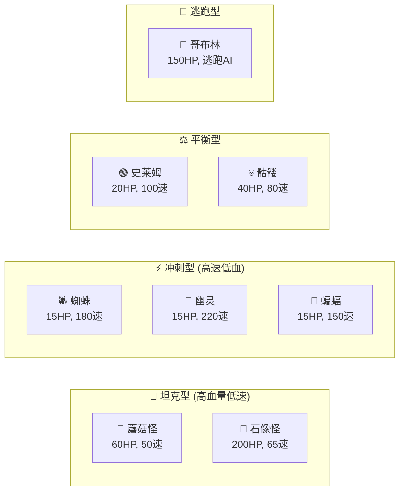

# 👾 敌人与刷怪设计文档

> 本文档详细记录了游戏中所有敌人类型及刷怪时间表配置。

---

## 📌 概述

| 统计项 | 数值 |
|:---|:---:|
| 敌人类型 | 8 种 |
| 刷怪时间表 | 2 个 |
| 敌人上限 | 300 |
| 精英怪启动时间 | 5 分钟 |
| 精英怪概率 | 10% |

---

## 👾 敌人类型详细参数

### 基础敌人

| 敌人 | 图标 | 生命 | 速度 | 伤害 | 大小 | 经验球 | 金币 |
|:---|:---:|:---:|:---:|:---:|:---:|:---:|:---:|
| 史莱姆 | 🟢 | 20 | 100 | 10 | 24 | 小 | 1-3 |
| 蜘蛛 | 🕷️ | 15 | 180 | 8 | 22 | 小 | 1-3 |
| 蝙蝠 | 🦇 | 15 | 150 | 5 | 20 | 小 | 1-2 |
| 幽灵 | 👻 | 15 | 220 | 4 | 18 | 小 | 1-2 |
| 蘑菇怪 | 🍄 | 60 | 50 | 12 | 28 | 中 | 2-5 |
| 骷髅 | 💀 | 40 | 80 | 15 | 28 | 小 | 2-5 |
| 石像怪 | 🗿 | 200 | 65 | 25 | 40 | 中 | 5-10 |
| 宝藏哥布林 | 👺 | 150 | 130 | 0 | 20 | 大 | 50-100 |

### 敌人特性分析



---

## 👹 精英怪加成

当游戏时间 ≥ 5分钟 时，生成的敌人有 10% 概率变为精英怪：

| 敌人 | 生命倍率 | 伤害倍率 | 体型倍率 | 速度倍率 | 经验球 | 金币 |
|:---|:---:|:---:|:---:|:---:|:---:|:---:|
| 🟢 史莱姆 | ×3.0 | ×2.0 | ×1.2 | - | 中 | 5-10 |
| 🕷️ 蜘蛛 | ×2.5 | ×1.5 | ×1.2 | ×1.2 | 中 | 4-8 |
| 🦇 蝙蝠 | ×2.0 | ×1.5 | ×1.1 | ×1.2 | 小 | 3-6 |
| 🍄 蘑菇怪 | ×3.0 | ×2.0 | ×1.3 | - | 大 | 10-20 |
| 👻 幽灵 | ×2.5 | ×2.0 | ×1.1 | ×1.1 | 中 | 4-8 |
| 💀 骷髅 | ×2.5 | ×1.5 | ×1.15 | - | 中 | 8-15 |
| 🗿 石像怪 | ×2.5 | ×1.8 | ×1.1 | - | 大 | 20-40 |
| 👺 哥布林 | ×3.0 | - | ×1.5 | - | 大 | 200-500 |

**特殊掉落**:
- 🗿 石像怪: 25% 掉落宝箱 (精英: 75%)
- 👺 哥布林: 80% 掉落宝箱 (精英: 100%)

---

## ⏱️ 刷怪时间表

### 森林普通 (FOREST_NORMAL)

这是默认地图的刷怪时间表，设计为渐进式难度曲线：

```mermaid
gantt
    title 森林普通刷怪时间表
    dateFormat s
    axisFormat %M:%S
    
    section 史莱姆
    初始800ms    :0, 30s
    加速600ms    :30s, 45s
    高压300ms    :120s, 240s
    
    section 蜘蛛
    出现600ms    :45s, 210s
    高压500ms    :210s, 240s
    
    section 幽灵
    出现800ms    :60s, 210s
    高压600ms    :210s, 240s
    
    section 蝙蝠
    出现600ms    :90s, 210s
    高压500ms    :210s, 240s
    
    section 蘑菇怪
    出现1500ms   :100s, 240s
    
    section 骷髅
    出现1000ms   :120s, 240s
    
    section 石像怪
    出现5000ms   :180s, 240s
    高压3000ms   :240s, 300s
```

#### 详细时间点

| 时间 | 新增敌人 | 刷新间隔(ms) | 阶段 |
|:---:|:---|:---:|:---|
| 0:00 | 🟢 史莱姆 | 800 | Phase 1: 新手适应 |
| 0:30 | 🟢 史莱姆 | 600 | 加速期 |
| 0:45 | 🕷️ 蜘蛛 | 600 | Phase 1.5: 快速群体 |
| 1:00 | 👻 幽灵 | 800 | Phase 2: 高速怪 |
| 1:30 | 🦇 蝙蝠 | 600 | Phase 3: 混合压力 |
| 1:40 | 🍄 蘑菇怪 | 1500 | Phase 3.5: 肉盾 |
| 2:00 | 🟢 史莱姆 | 300 | Phase 4: 高压 |
| 2:00 | 💀 骷髅 | 1000 | 中型敌人 |
| 3:00 | 🗿 石像怪 | 5000 | Phase 5: Boss型 |
| 3:30 | 👻/🦇/🕷️ | 500-600 | Phase 6: 快速群体 |
| 4:00 | 🗿 石像怪 | 3000 | Phase 7: 更多精英 |

---

### 地穴困难 (CRYPT_HARD)

高难度地图，更早出现强力敌人：

| 时间 | 敌人 | 刷新间隔(ms) | 备注 |
|:---:|:---|:---:|:---|
| 0:00 | 💀 骷髅 | 2000 | 直接中型敌人 |
| 0:00 | 🦇 蝙蝠 | 1000 | 双线压力 |
| 0:30 | 🕷️ 蜘蛛 | 500 | 快速群体 |
| 0:45 | 👻 幽灵 | 800 | 高速怪 |
| 1:00 | 🗿 石像怪 | 8000 | 提前出现Boss |
| 1:00 | 💀 骷髅 | 500 | 大量骷髅 |
| 2:00 | 🦇/👻 | 200-400 | 极速群体 |
| 3:00 | 🗿 石像怪 | 4000 | Boss数量翻倍 |
| 3:00 | 🍄 蘑菇怪 | 1000 | 大量肉盾 |

---

## 🎪 地图事件系统

除了常规刷怪，游戏还有随机事件系统：

| 事件 | 概率 | 持续时间 | 效果 |
|:---|:---:|:---:|:---|
| 🔴 围攻 (SIEGE) | 50% | 15秒 | 高频刷怪单一类型 (~10/秒) |
| 💰 宝藏狩猎 (TREASURE_HUNT) | 30% | 5秒 | 生成3-5只宝藏哥布林 |
| 💠 圣殿降临 (SHRINE_SPAWN) | 20% | 2秒 | 在玩家附近生成探索点 |

**围攻敌人类型**:
- 0-2分钟: 蝙蝠
- 2-5分钟: 蜘蛛
- 5分钟+: 幽灵

**事件间隔**: 45-90秒 (随机)

---

## 🔄 刷怪公式

### 刷怪间隔计算

```
刷怪间隔 = rate (毫秒)
每秒刷怪数 = 1000 / rate

示例:
  rate = 800ms → 每秒 1.25 只
  rate = 300ms → 每秒 3.33 只
  rate = 5000ms → 每秒 0.2 只
```

### 刷怪位置计算

```
angle = random() × 2π
radius = max(屏幕宽, 屏幕高) / 2 + 50

x = 玩家X + cos(angle) × radius
y = 玩家Y + sin(angle) × radius

// 敌人总是在视野边缘外生成
```

---

## ✅ 已确认实现

| 项目 | 实现详情 |
|:---|:---|
| 生成时间表 | `spawnData.ts` 定义两张地图: `FOREST_NORMAL` (13个事件) 和 `CRYPT_HARD` (11个事件) |
| `gameConfig.ts` | 包含废弃的 `SPAWN_SCHEDULE`，不再使用 |
| 精英怪行为 | 无特殊行为（闪避/护盾），仅有 HP/伤害/大小 倍率调整 |

---

## 📝 配置文件位置

```
src/data/enemyData.ts           # 敌人属性定义
src/data/spawnData.ts           # 刷怪时间表
src/core/systems/SpawnSystem.ts # 刷怪逻辑实现
```
