# 🔄 武器进化矩阵文档

> 本文档详细记录了游戏中所有 18 条武器进化路线及其解锁条件。

---

## 📌 概述

| 统计项 | 数值 |
|:---|:---:|
| 进化配方总数 | 18 |
| 武器线数量 | 7 |
| 最高进化等级 | Tier 3 |

---

## 🗺️ 进化总览图

```mermaid
graph LR
    subgraph "物理投射线"
        BULLET["🔫 手枪<br/>T1"] -->|坚韧| GATLING["🦾 加特林<br/>T2"]
        GATLING -->|疾风| DOOM["👹 末日炮<br/>T3"]
    end
    
    subgraph "回旋线"
        BOOM["🥏 回旋镖<br/>T1"] -->|疾风| SONIC["💿 音速飞碟<br/>T2"]
        SONIC -->|坚韧| VOID["🌌 虚空吞噬<br/>T3"]
    end
    
    subgraph "火焰光环线"
        SUN["🔥 烈阳<br/>T1"] -->|再生| NOVA["🌞 超新星<br/>T2"]
        NOVA -->|再生| BLACK["🕳️ 黑洞<br/>T3"]
    end
    
    subgraph "毒系线"
        DAGGER["🗡️ 毒匕首<br/>T1"] -->|坚韧| VENOM["🐍 毒牙<br/>T2"]
        VENOM -->|再生| PLAGUE["☠️ 瘟疫镰刀<br/>T3"]
    end
    
    subgraph "召唤线"
        SPIRIT["👻 灵魂宝珠<br/>T1"] -->|神圣新星| PHANTOM["👁️ 幻影守卫<br/>T2"]
        PHANTOM -->|动量| SOUL["🌀 灵魂漩涡<br/>T3"]
    end
    
    subgraph "链式线"
        CHAIN["⛓️ 链电<br/>T1"] -->|元素精通| SHOCK["⚡ 电击链<br/>T2"]
        SHOCK -->|暴击精通| STORM["🌩️ 风暴编织<br/>T3"]
    end
    
    subgraph "陷阱线"
        SPIKE["📌 尖刺陷阱<br/>T1"] -->|疾风| FROST["💎 寒霜地雷<br/>T2"]
        FROST -->|坚韧| RIFT["🌑 虚空裂隙<br/>T3"]
    end

    style DOOM fill:#ff6b6b,color:#fff
    style VOID fill:#9c88ff,color:#fff
    style BLACK fill:#2d3436,color:#fff
    style PLAGUE fill:#00b894,color:#fff
    style SOUL fill:#a29bfe,color:#fff
    style STORM fill:#fdcb6e,color:#000
    style RIFT fill:#636e72,color:#fff
```



---

## 📊 进化配方详细表

### 物理投射线 (Physical Projectile)

| 基础武器 | 所需技能 | 进化武器 | 关键提升 |
|:---|:---|:---|:---|
| 🔫 手枪 (MAX) | ❤️ 坚韧 | 🦾 加特林 | CD 800ms → 150ms |
| 🦾 加特林 (MAX) | 💨 疾风 | 👹 末日炮 | 伤害 40 → 150 |

### 回旋线 (Boomerang)

| 基础武器 | 所需技能 | 进化武器 | 关键提升 |
|:---|:---|:---|:---|
| 🥏 回旋镖 (MAX) | 💨 疾风 | 💿 音速飞碟 | 穿透 4 → ∞ |
| 💿 音速飞碟 (MAX) | ❤️ 坚韧 | 🌌 虚空吞噬者 | 伤害 120 → 180, 暗属性 |

### 火焰光环线 (Fire Aura)

| 基础武器 | 所需技能 | 进化武器 | 关键提升 |
|:---|:---|:---|:---|
| 🔥 烈阳 (MAX) | ➕ 再生 | 🌞 超新星 | 范围 100 → 160, 燃烧 20DPS |
| 🌞 超新星 (MAX) | ➕ 再生 | 🕳️ 黑洞 | 范围 250, 减速80% |

### 毒系线 (Poison)

| 基础武器 | 所需技能 | 进化武器 | 关键提升 |
|:---|:---|:---|:---|
| 🗡️ 毒匕首 (MAX) | ❤️ 坚韧 | 🐍 毒牙 | 毒素 3DPS → 8DPS |
| 🐍 毒牙 (MAX) | ➕ 再生 | ☠️ 瘟疫镰刀 | 毒素 15DPS, 击杀扩散 |

### 召唤线 (Summoning)

| 基础武器 | 所需技能 | 进化武器 | 关键提升 |
|:---|:---|:---|:---|
| 👻 灵魂宝珠 (MAX) | 🌟 神圣新星 | 👁️ 幻影守卫 | 伤害 10 → 30 |
| 👁️ 幻影守卫 (MAX) | 🏃 动量 | 🌀 灵魂漩涡 | 半径 180, 速度 180°/秒 |

### 链式线 (Chain)

| 基础武器 | 所需技能 | 进化武器 | 关键提升 |
|:---|:---|:---|:---|
| ⛓️ 链电 (MAX) | 🔥 元素精通 | ⚡ 电击链 | 弹跳 2 → 4, 眩晕 0.3秒 |
| ⚡ 电击链 (MAX) | ⚔️ 暴击精通 | 🌩️ 风暴编织者 | 弹跳 5, 眩晕 0.5秒 |

### 陷阱线 (Trap)

| 基础武器 | 所需技能 | 进化武器 | 关键提升 |
|:---|:---|:---|:---|
| 📌 尖刺陷阱 (MAX) | 💨 疾风 | 💎 寒霜地雷 | 减速 60%, 范围 60 |
| 💎 寒霜地雷 (MAX) | ❤️ 坚韧 | 🌑 虚空裂隙 | 持续吸引, DOT 25/秒 |

---

## 🔀 独立进化 (不属于武器线)

| 基础武器 | 所需技能 | 进化武器 | 关键提升 |
|:---|:---|:---|:---|
| ❄️ 冰晶碎片 (MAX) | 🔥 元素精通 | 🌨️ 冰霜风暴 | 3道激光, 减速70% |
| 🔮 魔法飞弹 (MAX) | 🎯 弹道学 | 💫 奥术蜂群 | 穿透+1, CD 800ms |
| ⚡ 雷杖 (MAX) | 🔥 元素精通 | 🌩️ 链式闪电 | 5目标连锁 |
| 🗡️ 武士刀 (MAX) | 💨 疾风 | ⚔️ 暗影之刃 | 伤害 90, 范围 120 |

---

## 📋 进化条件速查

### 按技能分类

| 技能 | 解锁的进化数量 | 进化列表 |
|:---|:---:|:---|
| ❤️ 坚韧 | 4 | 手枪→加特林, 音速飞碟→虚空, 毒匕首→毒牙, 寒霜→虚空裂隙 |
| 💨 疾风 | 4 | 加特林→末日炮, 回旋镖→音速, 尖刺→寒霜, 武士刀→暗影 |
| ➕ 再生 | 3 | 烈阳→超新星, 超新星→黑洞, 毒牙→瘟疫镰刀 |
| 🔥 元素精通 | 3 | 链电→电击链, 冰晶→冰霜风暴, 雷杖→链式闪电 |
| 🌟 神圣新星 | 1 | 灵魂宝珠→幻影守卫 |
| 🏃 动量 | 1 | 幻影守卫→灵魂漩涡 |
| ⚔️ 暴击精通 | 1 | 电击链→风暴编织者 |
| 🎯 弹道学 | 1 | 魔法飞弹→奥术蜂群 |

---

## 🎯 进化触发条件

进化在以下情况触发：

```
1. 玩家拾取宝箱
2. 检查所有进化配方:
   - 拥有基础武器 且 基础武器满级 (MAX)
   - 拥有所需技能
   - 尚未拥有进化后的武器
3. 如果满足条件，执行进化:
   - 基础武器被替换为进化武器
   - 进化武器初始为1级
   - 显示进化动画和通知
```

---

## 🧮 进化优先级

当多个进化条件同时满足时，按 `EVOLUTION_RECIPES` 数组顺序检查，**第一个满足的配方优先执行**。

当前顺序：
1. Tier 1 → Tier 2 (物理/回旋/火焰)
2. Tier 2 → Tier 3 (递归进化)
3. v2.0 新增线 (毒/召唤/链/陷阱)
4. 独立进化

---

## ✅ 已确认实现

| 项目 | 实现详情 |
|:---|:---|
| 进化武器升级 | `upgradeData.ts` 包含 Tier 2 武器 (`GATLING_GUN`, `SONIC_DISC`, `SUPERNOVA` 等) 的升级路径 |
| 级别继承 | 进化武器从 **Lv.1 重新开始**，不保留基础武器的升级效果 |
| 进化配方数 | 18 条（`evolutionData.ts` Tier 1→2 和 Tier 2→3） |

---

## 📝 配置文件位置

```
src/data/evolutionData.ts   # 进化配方定义
src/core/Game.ts            # 进化触发逻辑 (checkAndPerformEvolution)
```
