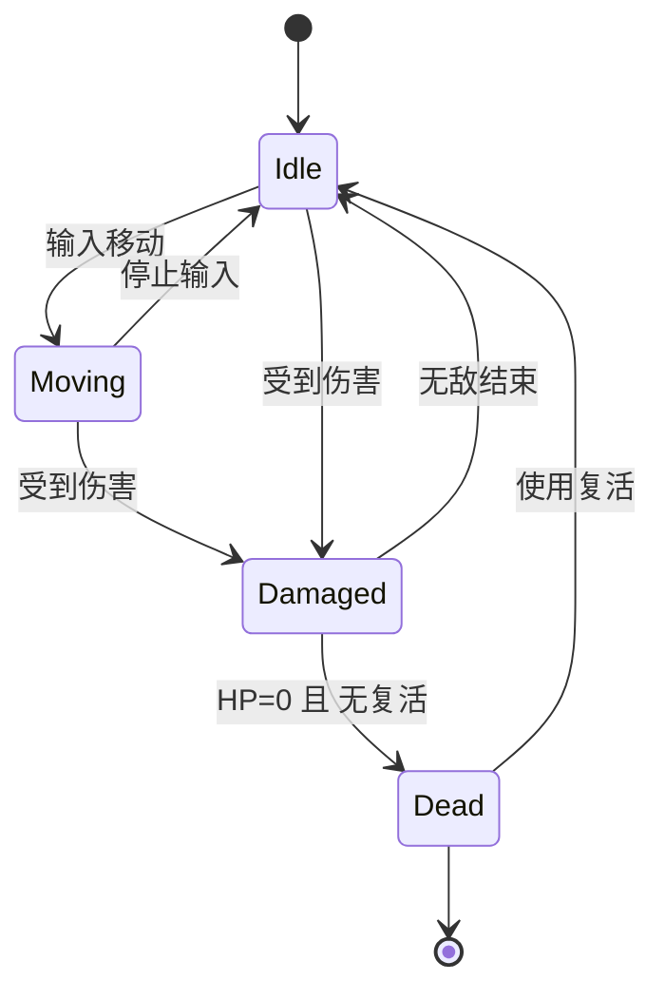

# 🎮 玩家系统与角色数据

> 本文档详细记录玩家实体的完整状态机、输入处理、角色系统和元进度系统。

---

## 📌 系统概述

| 系统模块 | 功能 |
|:---|:---|
| 玩家状态 | HP/速度/等级/金币/复活 |
| 输入处理 | 键盘 + 虚拟摇杆 |
| 战斗系统 | 暴击/护盾/动量/吸血 |
| 技能系统 | 主动/被动技能应用 |
| 动画系统 | 8方向精灵动画 |
| 元进度 | 永久升级加成 |

---

## 📊 玩家基础数据

```typescript
// src/data/playerData.ts
export const PLAYER_DATA = {
    hp: 100,        // 基础生命值
    speed: 200,     // 像素/秒
    size: 32,       // 碰撞体大小
    revives: 1,     // 复活次数
    hpRegen: 0.5    // HP/秒 自然回复
};
```

---

## 🧙 角色系统

### 角色总览表

| 角色 | 初始武器 | 初始技能 | 特殊属性 |
|:---|:---|:---|:---|
| 🛡️ 骑士 | 🔫 手枪 | ❤️ 坚韧 | +10% 伤害 |
| 🗡️ 盗贼 | 🥏 回旋镖 | 💨 疾风 | 80HP, 240速度 |
| 🔮 法师 | 🔥 烈阳 | ➕ 再生 | 90HP, 180速度, 1.5回复 |
| ✨ 牧师 | 🔮 魔法飞弹 | ➕ 再生 | 110HP, 1.0回复 |
| 🏹 猎人 | 🥏 回旋镖 | 💨 疾风 | 90HP, 230速度 |
| 👿 术士 | ❄️ 冰晶碎片 | ❤️ 坚韧 | 75HP, +50%状态持续 |

### 角色数据详解

| 角色 ID | 名称键 | HP | 速度 | 回复 | 伤害倍率 |
|:---|:---|:---:|:---:|:---:|:---:|
| KNIGHT | character.knight | 100 | 200 | 0.5 | ×1.1 |
| ROGUE | character.rogue | 80 | 240 | 0.5 | ×1.0 |
| MAGE | character.mage | 90 | 180 | 1.5 | ×1.0 |
| CLERIC | character.cleric | 110 | 200 | 1.0 | ×1.0 |
| HUNTRESS | character.huntress | 90 | 230 | 0.5 | ×1.0 |
| WARLOCK | character.warlock | 75 | 200 | 0.5 | ×1.0 |

---

## ⚔️ 战斗子系统

### 暴击系统

```typescript
calculateCritDamage(baseDamage: number): { damage: number, isCrit: boolean } {
    if (this.critChance > 0 && Math.random() < this.critChance) {
        return { damage: baseDamage * this.critMultiplier, isCrit: true };
    }
    return { damage: baseDamage, isCrit: false };
}
```

| 参数 | 初始值 | 来源 |
|:---|:---:|:---|
| critChance | 0% | ⚔️ 暴击精通技能 (+8%) |
| critMultiplier | 1.0× | ⚔️ 暴击精通技能 (+0.8) |

### 护盾系统

```typescript
updateShield(dt: number) {
    if (shieldInterval > 0 && shieldCharges < shieldMaxCharges) {
        shieldTimer -= dt * 1000;
        if (shieldTimer <= 0) {
            shieldCharges = min(shieldMaxCharges, shieldCharges + 1);
            shieldTimer = shieldInterval;
        }
    }
}
```

| 参数 | 初始值 | 来源 |
|:---|:---:|:---|
| shieldCharges | 0 | 🛡️ 护盾精通技能 |
| shieldMaxCharges | 0 | 🛡️ 护盾精通 (+1) |
| shieldInterval | 0ms | 🛡️ 护盾精通 (+10000ms) |

**机制**: 护盾层数完全吸收一次伤害，每 10 秒恢复 1 层

### 动量系统

```typescript
updateMomentum(isMoving: boolean, dt: number): number | null {
    if (momentumMaxStacks === 0) return null;

    if (isMoving) {
        // 移动时积攒层数 (1层/100ms)
        momentumStacks = min(momentumMaxStacks, momentumStacks + dt * 10);
        wasMovingLastFrame = true;
    } else if (wasMovingLastFrame && momentumStacks > 0) {
        // 停止移动 - 释放动量波
        const damage = momentumStacks * momentumDamagePerStack;
        momentumStacks = 0;
        return damage; // AOE 伤害
    }
    return null;
}
```

| 参数 | 初始值 | 来源 |
|:---|:---:|:---|
| momentumMaxStacks | 0 | 🏃 动量技能 (+100) |
| momentumDamagePerStack | 0 | 🏃 动量技能 (+0.5) |
| momentumRadius | 0 | 🏃 动量技能 (+150px) |

**机制**: 移动积攒层数，停止时释放 AOE，最大 100 层 × 0.5 = 50 伤害

### 吸血系统

```typescript
onEnemyKill() {
    if (onKillHealPercent > 0) {
        hp = min(maxHp, hp + maxHp * onKillHealPercent);
    }
}
```

| 参数 | 初始值 | 来源 |
|:---|:---:|:---|
| onKillHealPercent | 0% | 🧛 吸血技能 (+0.5%) |

---

## 🎮 输入系统

### 键盘映射

| 按键 | 动作 |
|:---|:---|
| W / ↑ | 向上移动 |
| S / ↓ | 向下移动 |
| A / ← | 向左移动 |
| D / → | 向右移动 |

### 虚拟摇杆

```typescript
// 摇杆输入覆盖键盘
if (input.joystickVector.x !== 0 || input.joystickVector.y !== 0) {
    moveVector.x = input.joystickVector.x;
    moveVector.y = input.joystickVector.y;
}
```

### 移动向量处理

```typescript
// 归一化防止对角线加速
if (moveVector.x !== 0 || moveVector.y !== 0) {
    moveVector.normalize();
    facingDirection = new Vector2D(moveVector.x, moveVector.y);
}

// 速度应用 (整数速度，浮点位置)
this.pos.x += moveVector.x * this.speed * dt;
this.pos.y += moveVector.y * this.speed * dt;
```

---

## 🔄 玩家状态机



---

## 💎 经验与升级

### 经验球数据

| 类型 | XP 值 | 大小 | 颜色 |
|:---|:---:|:---:|:---|
| SMALL | 5 | 8px | #42a5f5 (蓝) |
| MEDIUM | 20 | 12px | #66bb6a (绿) |
| LARGE | 50 | 16px | #ffee58 (黄) |

### 升级回复

```typescript
// 升级时恢复 20% 最大生命
hp = Math.min(maxHp, hp + maxHp * 0.2);
```

---

## 🗺️ 地图数据

| 地图 ID | 名称 | 瓦片大小 | 装饰 | 生成表 |
|:---|:---|:---:|:---|:---|
| FOREST | 森林 | 100px | 花朵 | FOREST_NORMAL |
| CRYPT | 地穴 | 100px | 裂缝 | CRYPT_HARD |

### 地图颜色配置

| 地图 | 基础色 1 | 基础色 2 | 背景色 |
|:---|:---|:---|:---|
| FOREST | #C8E6C9 | #A5D6A7 | #A5D6A7 |
| CRYPT | #B0BEC5 | #90A4AE | #90A4AE |

---

## 🎁 宝箱掉落表

```typescript
export const CHEST_LOOT_TABLE = {
    gold: { min: 50, max: 150 },
    xpOrbs: [
        { type: 'SMALL', count: [3, 5] },
        { type: 'MEDIUM', count: [1, 3] },
    ],
    upgrades: {
        chance: 1.0,  // 100% 尝试升级
        count: 1
    }
};
```

| 奖励类型 | 范围 | 期望值 |
|:---|:---|:---:|
| 金币 | 50~150 | 100 |
| 小型XP球 | 3~5个 (×5XP) | 20 XP |
| 中型XP球 | 1~3个 (×20XP) | 40 XP |
| 升级次数 | 1 | - |

---

## 📈 元进度系统接口

```typescript
const metaBonuses = progressionManager.getPlayerBonuses();

this.maxHp += metaBonuses.maxHpAdd;
this.speed *= (1 + metaBonuses.speedMultiplier);
this.hpRegen += metaBonuses.hpRegenAdd;
this.revives += metaBonuses.revivesAdd;
this.damageMultiplier += metaBonuses.damageMultiplier;
this.goldMultiplier += metaBonuses.goldMultiplier;
```

---

## 📝 源代码位置

```
src/entities/Player.ts       # 玩家实体 (795行)
src/data/playerData.ts       # 玩家基础数据
src/data/characterData.ts    # 角色定义 (6个角色)
src/data/xpOrbData.ts        # 经验球数据
src/data/lootData.ts         # 宝箱掉落表
src/data/mapData.ts          # 地图数据
src/core/ProgressionManager.ts # 元进度管理
```
