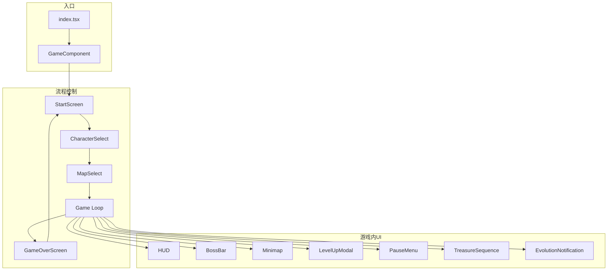

# 🖥️ UI 组件与项目结构

> 本文档记录 React UI 组件树和整体项目结构，为复刻提供完整的架构蓝图。

---

## 📌 项目结构

```
src/
├── index.tsx              # 应用入口
├── GameComponent.tsx      # 游戏画布包装器
│
├── components/            # React UI 组件 (21个)
│   ├── StartScreen.tsx    # 开始界面
│   ├── CharacterSelect.tsx # 角色选择
│   ├── MapSelect.tsx      # 地图选择
│   ├── HUD.tsx            # 抬头显示
│   ├── LevelUpModal.tsx   # 升级选择
│   ├── PauseMenu.tsx      # 暂停菜单
│   ├── GameOverScreen.tsx # 结束界面
│   └── ...
│
├── core/                  # 游戏引擎核心
│   ├── Game.ts            # 游戏主循环
│   ├── Camera.ts          # 相机系统
│   ├── EntityManager.ts   # 实体管理
│   ├── InputHandler.ts    # 输入处理
│   ├── ParticleSystem.ts  # 粒子系统
│   ├── SoundManager.ts    # 音效管理
│   ├── ProgressionManager.ts # 元进度
│   ├── i18n.ts            # 国际化
│   └── systems/
│       ├── CollisionSystem.ts
│       ├── SpawnSystem.ts
│       ├── MapRenderer.ts
│       └── MinimapRenderer.ts
│
├── entities/              # 游戏实体类
│   ├── Player.ts
│   ├── Enemy.ts
│   ├── Weapon.ts
│   ├── Skill.ts
│   ├── Projectile.ts
│   ├── BoomerangProjectile.ts
│   ├── LaserProjectile.ts
│   ├── HomingProjectile.ts
│   ├── LightningProjectile.ts
│   ├── SlashProjectile.ts
│   ├── ChainProjectile.ts
│   ├── OrbitingProjectile.ts
│   ├── TrapProjectile.ts
│   ├── XpOrb.ts
│   ├── Chest.ts
│   └── ...
│
├── data/                  # 静态数据定义
│   ├── weaponData.ts
│   ├── skillData.ts
│   ├── enemyData.ts
│   ├── characterData.ts
│   ├── evolutionData.ts
│   ├── upgradeData.ts
│   ├── skillUpgradeData.ts
│   ├── mapData.ts
│   ├── gameConfig.ts
│   └── ...
│
└── utils/                 # 工具类
    ├── types.ts           # TypeScript 类型
    ├── Vector2D.ts        # 2D 向量
    ├── ObjectPool.ts      # 对象池
    └── EventEmitter.ts    # 事件发射器
```

---

## 🎨 UI 组件列表

### 游戏流程组件

| 组件 | 文件大小 | 功能 |
|:---|:---:|:---|
| StartScreen | 6KB | 主菜单入口 |
| CharacterSelect | 5KB | 角色选择界面 |
| MapSelect | 1KB | 地图选择界面 |
| CreativeSetup | 12KB | 创意模式配置 |
| GameOverScreen | 2KB | 游戏结束界面 |

### 游戏内 HUD

| 组件 | 文件大小 | 功能 |
|:---|:---:|:---|
| HUD | 4KB | 血条/经验/金币/时间 |
| BossBar | 2KB | Boss 血条 |
| Minimap | 1KB | 小地图 |
| WeaponsPanel | 2KB | 武器栏显示 |
| SkillsPanel | 2KB | 技能栏显示 |
| VirtualJoystick | 3KB | 移动端虚拟摇杆 |

### 模态窗口

| 组件 | 文件大小 | 功能 |
|:---|:---:|:---|
| LevelUpModal | 6KB | 升级选择（3选1） |
| PauseMenu | 1KB | 暂停菜单 |
| ReviveModal | 2KB | 复活确认 |
| EvolutionNotification | 2KB | 武器进化通知 |

### 宝箱系统

| 组件 | 文件大小 | 功能 |
|:---|:---:|:---|
| Chest | 3KB | 宝箱实体渲染 |
| ChestOpeningAnimation | - | 开箱动画 |
| TreasureSequence | 6KB | 宝箱奖励序列 |
| FlyingItem | 0.3KB | 飞行物品效果 |

### 信息界面

| 组件 | 文件大小 | 功能 |
|:---|:---:|:---|
| Armory | 3KB | 武器图鉴 |
| Codex | 6KB | 游戏百科全书 |

---

## 🔗 组件依赖关系



---

## 📊 数据文件清单

### 核心数据

| 文件 | 内容 |
|:---|:---|
| weaponData.ts | 27种武器定义 |
| skillData.ts | 16种技能定义 |
| skillUpgradeData.ts | 5种技能升级路径 |
| upgradeData.ts | 14种武器升级路径 |
| evolutionData.ts | 18条进化配方 |
| enemyData.ts | 8种敌人定义 |
| characterData.ts | 6种角色定义 |

### 配置数据

| 文件 | 内容 |
|:---|:---|
| gameConfig.ts | 生成表/XP曲线 |
| mapData.ts | 2张地图定义 |
| playerData.ts | 玩家基础属性 |
| lootData.ts | 宝箱掉落表 |
| xpOrbData.ts | 3种经验球 |
| chestData.ts | 宝箱动画数据 |
| itemData.ts | 物品定义 |
| propData.ts | 可破坏道具 |
| rarityData.ts | 稀有度颜色 |
| metaUpgradeData.ts | 元进度升级 |

---

## 🌐 国际化 (i18n)

### 支持语言

| 语言 | 键前缀示例 |
|:---|:---|
| English (en) | weapon.bullet.name |
| 简体中文 (zh-CN) | weapon.bullet.name |

### 命名空间

| 命名空间 | 示例键 |
|:---|:---|
| weapon | weapon.{id}.name/desc |
| skill | skill.{id}.name/desc |
| character | character.{id}.name/desc |
| enemy | enemy.{id}.name/desc |
| map | map.{id}.name/desc |
| upgrade | upgrade.{id}.{level} |
| ui | ui.levelUp/ui.maxLevel |

---

## 📁 实体类清单

### 弹道实体

| 类 | 武器类型 | 特殊行为 |
|:---|:---|:---|
| Projectile | PROJECTILE | 直线飞行 |
| BoomerangProjectile | BOOMERANG | 往返飞行 |
| LaserProjectile | LASER | 即时直线 |
| HomingProjectile | HOMING_PROJECTILE | 目标追踪 |
| LightningProjectile | LIGHTNING | 即时打击 |
| SlashProjectile | MELEE | 弧形挥砍 |
| ChainProjectile | CHAIN | 弹跳传递 |
| OrbitingProjectile | ORBITING | 环绕玩家 |
| TrapProjectile | TRAP | 静止触发 |

### 其他实体

| 类 | 功能 |
|:---|:---|
| Enemy | 敌人实体 |
| XpOrb | 经验球 |
| Chest | 宝箱 |
| Item | 掉落物品 |
| Prop | 可破坏道具 |
| Particle | 粒子效果 |
| FloatingText | 浮动文字 |
| AuraEffect | 光环视效 |
| PulseEffect | 脉冲视效 |
| ExplorationPoint | 探索点 |

---

## 📝 源代码位置

```
src/index.tsx              # 应用入口
src/GameComponent.tsx      # 游戏画布包装
src/components/            # UI 组件 (21个)
src/core/                  # 引擎核心 (12个)
src/entities/              # 实体类 (20+个)
src/data/                  # 数据文件 (15+个)
src/utils/                 # 工具类 (4个)
```
