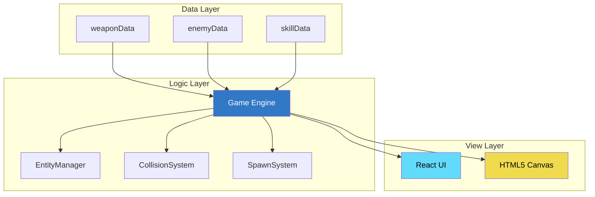

# 📚 Sparkle Survivors - Architecture Documentation

> Complete technical reference for the Vampire Survivors-like roguelite game engine.

---

## 📖 Documentation Index

| # | Document | Description |
|---|----------|-------------|
| 01 | [System Overview](./architecture/01-system-overview.md) | High-level DLV architecture, layer responsibilities, design patterns |
| 02 | [Class Hierarchy](./architecture/02-class-hierarchy.md) | Entity relationships, inheritance, object pools |
| 03 | [Game Loop](./architecture/03-game-loop.md) | Update cycle, collision system, spawn timeline |
| 04 | [Weapon System](./architecture/04-weapon-system.md) | 13 weapons, combat flow, status effects |
| 05 | [Enemy System](./architecture/05-enemy-system.md) | 7 enemy types, elite mechanics, flocking AI |
| 06 | [UI Components](./architecture/06-ui-components.md) | React architecture, screen flow, state management |
| 07 | [Progression System](./architecture/07-progression-system.md) | Meta-upgrades, save system, evolution |

---

## 🏗️ Architecture at a Glance



---

## 🔑 Key Concepts

### Data-Logic-View (DLV) Pattern
```
src/data/     → Pure JSON-like configuration (change numbers, not code)
src/core/     → Game engine (physics, systems, state)
src/entities/ → Game objects (player, enemies, weapons)
src/components/ → React UI (menus, HUD, modals)
```

### Performance Optimizations
- **Object Pooling**: Pre-allocated entity pools reduce GC
- **Spatial Hashing**: O(1) collision detection via grid cells
- **Staggered Updates**: Flocking computed every 10 frames per entity

### Core Design Patterns
| Pattern | Where Used |
|---------|------------|
| Object Pool | `EntityManager` for enemies, projectiles |
| Spatial Hash | `CollisionSystem` grid queries |
| State Machine | Player animations, enemy behavior |
| Event Emitter | `Game.events` for UI updates |
| Data-Driven | All configs in `/data/` |

---

## 🚀 Quick Start for Developers

### Adding a New Weapon
1. Add entry to `src/data/weaponData.ts`
2. Add upgrade path to `src/data/upgradeData.ts`
3. (Optional) Add new projectile type in `src/entities/`
4. No changes to `Weapon.ts` needed if using existing types

### Adding a New Enemy
1. Add entry to `src/data/enemyData.ts`
2. Add spawn event to `src/data/spawnData.ts`
3. (Optional) Add spritesheet to `public/enemies/`

### Adding a New UI Screen
1. Create component in `src/components/`
2. Add screen state to `GameComponent.tsx`
3. Add CSS in `src/styles/`

---

## 📊 Tech Stack

| Layer | Technology |
|-------|------------|
| Language | TypeScript 5.0+ |
| UI Framework | React 19 |
| Build Tool | Vite 6.0+ |
| Rendering | HTML5 Canvas 2D |
| Styling | CSS (no frameworks) |
| Audio | Web Audio API |
| Storage | LocalStorage |

---

## 📁 Project Structure

```
sparkle-survivors/
├── src/
│   ├── core/           # Game engine
│   │   ├── Game.ts
│   │   ├── EntityManager.ts
│   │   └── systems/
│   ├── entities/       # Game objects
│   │   ├── Player.ts
│   │   ├── Enemy.ts
│   │   └── Weapon.ts
│   ├── data/           # Configuration
│   │   ├── weaponData.ts
│   │   └── enemyData.ts
│   ├── components/     # React UI
│   │   ├── HUD.tsx
│   │   └── LevelUpModal.tsx
│   └── styles/         # CSS
├── public/
│   ├── locales/        # i18n
│   └── enemies/        # Sprites
└── documentation/      # This folder
```
