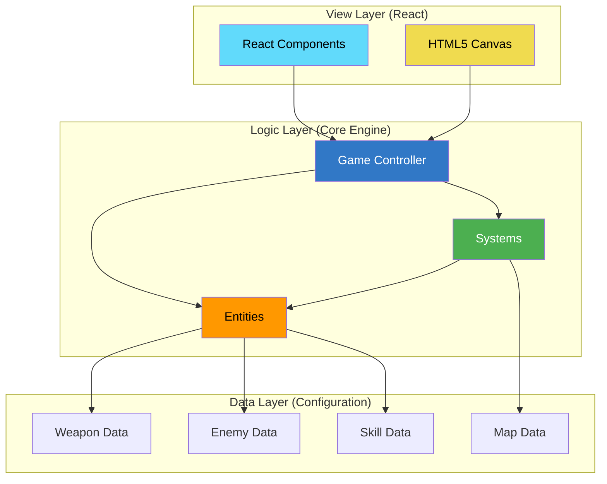
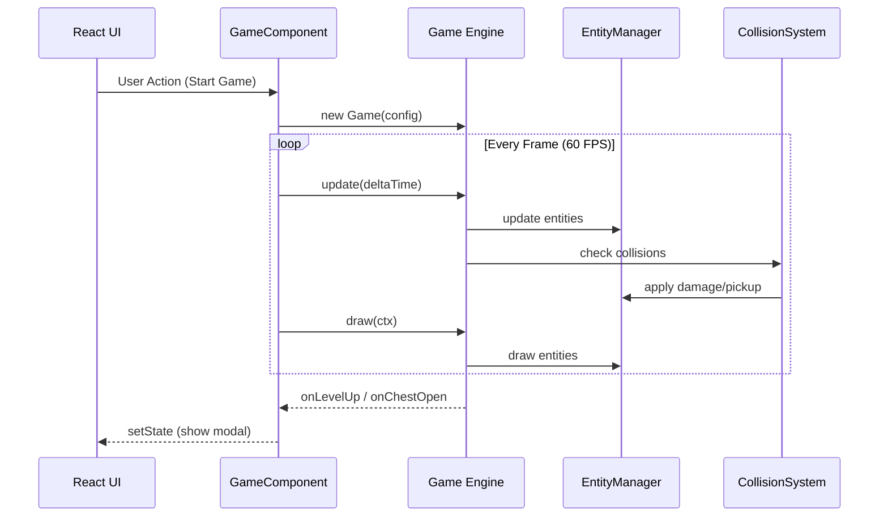

# 🏗️ Sparkle Survivors - System Architecture Overview

> A comprehensive technical reference for the Vampire Survivors-like roguelite game engine.

## Executive Summary

**Sparkle Survivors** is a high-performance browser game built with a custom HTML5 Canvas engine orchestrated by React. The architecture follows a strict **Data-Logic-View (DLV)** pattern ensuring clear separation of concerns.

---

## High-Level Architecture



---

## Layer Responsibilities

### 📊 Data Layer (`src/data/`)
| File | Purpose |
|------|---------|
| `weaponData.ts` | 13 weapons with type, damage, cooldown, effects |
| `enemyData.ts` | 7 enemy types with elite variants |
| `skillData.ts` | 5 skills (active/passive) |
| `gameConfig.ts` | XP tables, spawn schedules |
| `characterData.ts` | Playable character definitions |
| `metaUpgradeData.ts` | Permanent progression items |

### ⚙️ Logic Layer (`src/core/`, `src/entities/`)
- **Game.ts**: Main loop, state orchestration
- **EntityManager.ts**: Object pooling, lifecycle management  
- **Systems/**: Collision, Spawning, Map rendering
- **Entities/**: Player, Enemy, Weapon, Projectiles, Skills

### 🖥️ View Layer (`src/components/`)
- React-based UI overlays (HUD, Menus, Modals)
- Canvas rendering driven by `Game.draw()`
- State synchronization via callbacks

---

## System Interaction Flow



---

## Key Design Patterns

| Pattern | Implementation | Benefit |
|---------|---------------|---------|
| **Object Pool** | `EntityManager` pools for enemies, projectiles | Reduces GC pressure |
| **Spatial Hash Grid** | `CollisionSystem` grid queries | O(1) collision detection |
| **Data-Driven Design** | All config in `/data/` | No code changes for balance |
| **Event Emitter** | `Game.events` | Decoupled UI updates |
| **State Machine** | Player animation states | Clean animation logic |

---

## Performance Optimizations

1. **Object Pooling**: Pre-allocated pools for high-frequency entities
2. **Spatial Hashing**: 100×100 cell grid for collision detection
3. **Staggered Updates**: Flocking computation distributed across frames
4. **Canvas Optimizations**: Single draw context, batched rendering
5. **Lazy Loading**: Sound effects loaded on demand

---

## File Structure Summary

```
src/
├── core/                    # Engine Logic
│   ├── Game.ts             # Main Game Controller
│   ├── EntityManager.ts    # Entity Lifecycle & Pools
│   ├── Camera.ts           # Viewport Management
│   ├── ParticleSystem.ts   # VFX Controller
│   ├── SoundManager.ts     # Audio Engine
│   ├── ProgressionManager.ts # Save/Load/Meta
│   └── systems/
│       ├── CollisionSystem.ts
│       ├── SpawnSystem.ts
│       └── MapRenderer.ts
├── entities/                # Game Objects
│   ├── Player.ts
│   ├── Enemy.ts
│   ├── Weapon.ts
│   ├── Skill.ts
│   └── *Projectile.ts      # Various projectile types
├── data/                    # Pure Configuration
│   ├── weaponData.ts
│   ├── enemyData.ts
│   └── ...
└── components/              # React UI
    ├── HUD.tsx
    ├── LevelUpModal.tsx
    └── ...
```
