# 📐 Class Hierarchy & Entity Relationships

> Detailed class structure and inheritance patterns in Sparkle Survivors.

---

## Complete Class Diagram

---

## Entity Type Hierarchy

---

## Weapon Type Architecture

```mermaid
graph TB
    subgraph "Weapon Types"
        direction LR
        PROJECTILE["🔫 PROJECTILE<br/>Bullet, Gatling, Doom Cannon"]
        BOOMERANG["🥏 BOOMERANG<br/>Boomerang, Sonic Disc, Void Eater"]
        AURA["🔥 AURA<br/>Sunfire, Supernova, Black Hole"]
        LASER["❄️ LASER<br/>Ice Shard"]
        HOMING["🔮 HOMING<br/>Magic Missile"]
        LIGHTNING["⚡ LIGHTNING<br/>Thunder Staff"]
        MELEE["🗡️ MELEE<br/>Katana"]
    end

    Weapon --> PROJECTILE
    Weapon --> BOOMERANG
    Weapon --> AURA
    Weapon --> LASER
    Weapon --> HOMING
    Weapon --> LIGHTNING
    Weapon --> MELEE

    style Weapon fill:#ff9800,color:#000
```

---

## Object Pool Pattern

---

## Systems Dependency Graph

