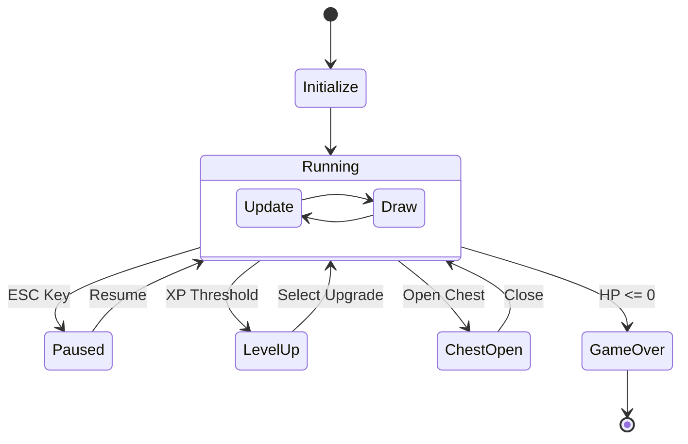
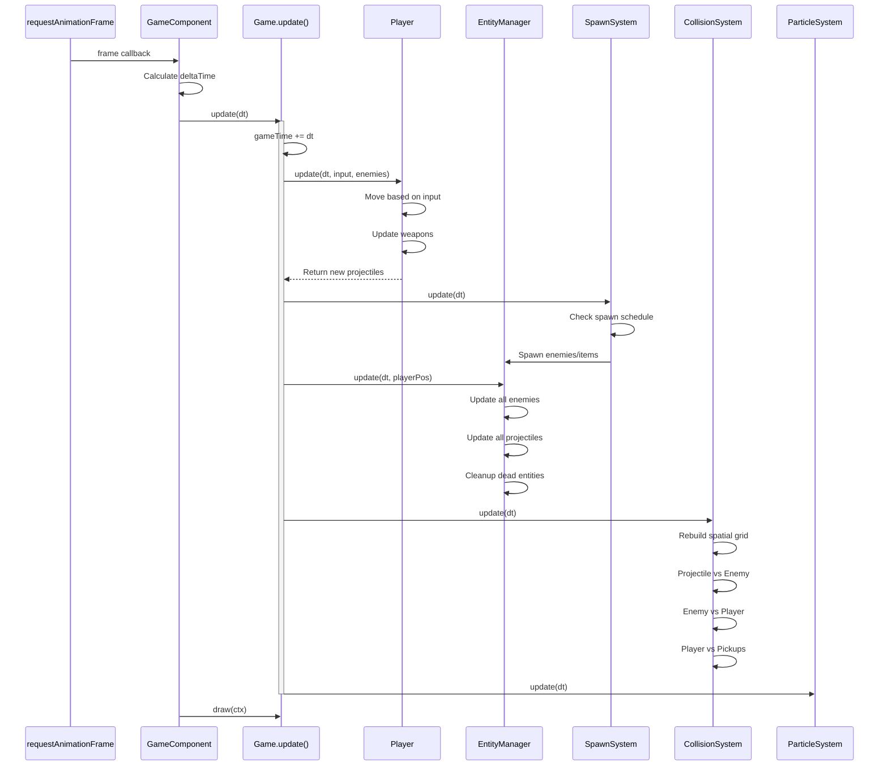
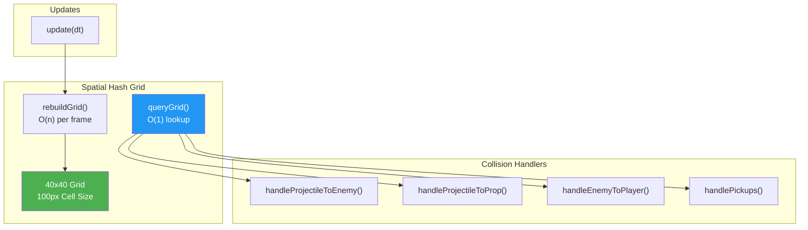
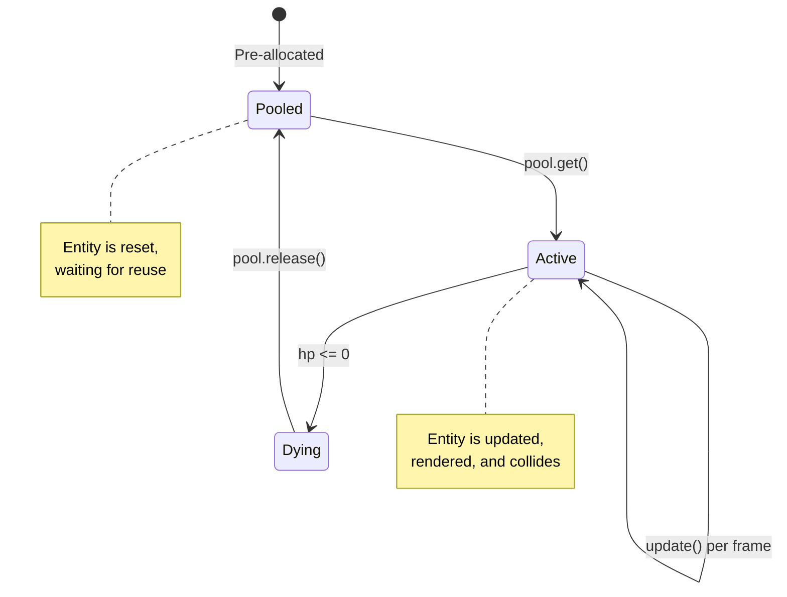
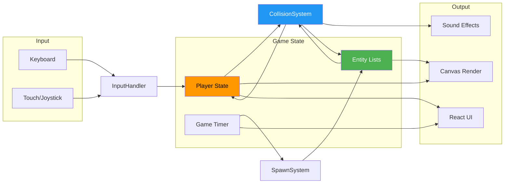

# 🔄 Game Loop & Core Systems

> Deep dive into the main game loop, update cycle, and system orchestration.

---

## Main Game Loop

---

## Update Cycle Sequence

---

## Collision System Architecture

---

## Spawn System Timeline

```mermaid
gantt
    title Enemy Spawn Schedule (Forest Map)
    dateFormat X
    axisFormat %s

    section Wave 1
    SLIME low-rate      :0, 30
    
    section Wave 2
    SPIDER joins        :30, 60
    SLIME rate increase :30, 60
    
    section Wave 3
    BAT joins          :60, 120
    
    section Wave 4
    MUSHROOM joins     :120, 180
    
    section Elite Phase
    10% Elite Chance   :300, 600
```

---

## Entity Lifecycle

---

## Data Flow Diagram

---

## Key Performance Metrics

| System | Complexity | Optimization |
|--------|-----------|--------------|
| **Grid Rebuild** | O(n) enemies | Once per frame |
| **Grid Query** | O(1) average | Cell-based lookup |
| **Projectile Update** | O(m) projectiles | Object pooling |
| **Flocking** | O(k) neighbors | Staggered 10-frame cycle |
| **Rendering** | O(n+m) entities | Batched canvas calls |
