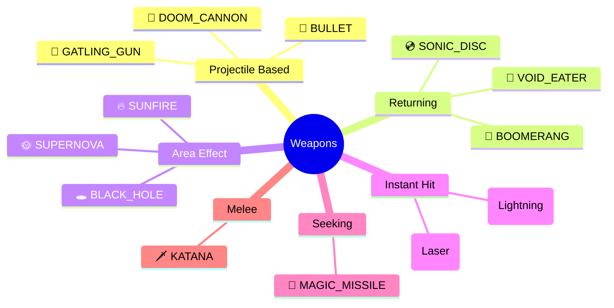
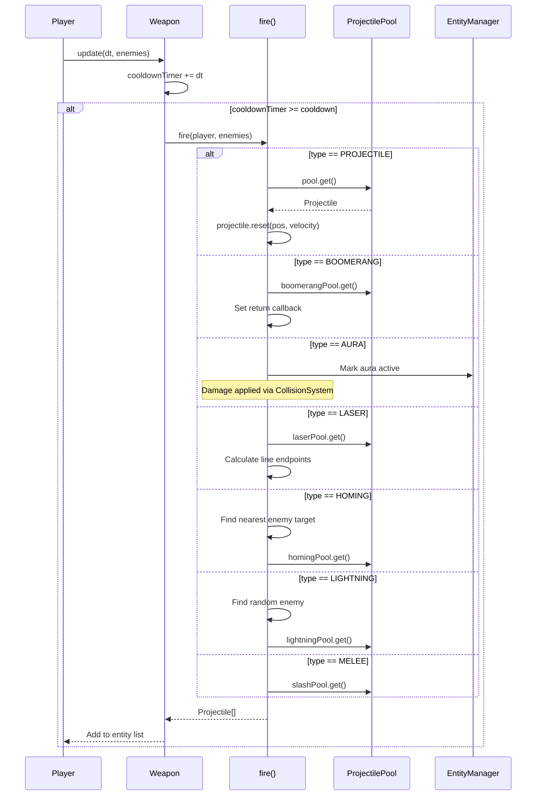
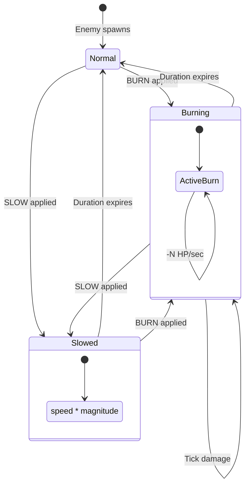
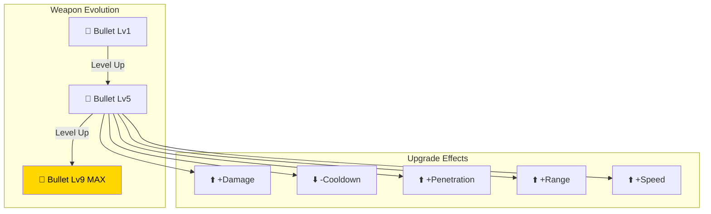
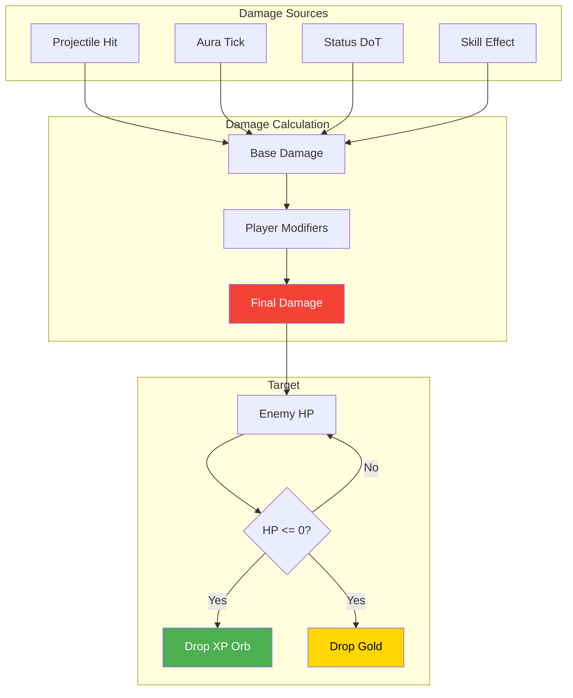

# ⚔️ Weapon & Combat System

> Complete reference for the weapon architecture, combat flow, and status effects.

---

## Weapon Type Matrix

---

## Weapon Fire Flow

---

## Weapon Stats Comparison

| Weapon | Type | Damage | Cooldown | Penetration | Special |
|--------|------|--------|----------|-------------|---------|
| 🔫 Bullet | PROJECTILE | 36 | 800ms | 1 | - |
| 🦾 Gatling Gun | PROJECTILE | 40 | 100ms | 2 | Very Fast |
| 👹 Doom Cannon | PROJECTILE | 150 | 80ms | 5 | Extreme |
| 🥏 Boomerang | BOOMERANG | 75 | 3000ms | ∞ | Returns |
| 💿 Sonic Disc | BOOMERANG | 120 | 2000ms | ∞ | Fast Return |
| 🌌 Void Eater | BOOMERANG | 250 | 1500ms | ∞ | Evolved |
| 🔥 Sunfire | AURA | 15/tick | 1000ms | ∞ | Burn |
| 🌞 Supernova | AURA | 30/tick | 500ms | ∞ | Evolved |
| 🕳️ Black Hole | AURA | 100/tick | 250ms | ∞ | 80% Slow |
| ❄️ Ice Shard | LASER | 24 | 1200ms | ∞ | 50% Slow |
| 🔮 Magic Missile | HOMING | 36 | 1500ms | 1 | Auto-aim |
| ⚡ Thunder Staff | LIGHTNING | 50 | 3000ms | 1 | AoE |
| 🗡️ Katana | MELEE | 45 | 1500ms | ∞ | Arc Slash |

---

## Status Effect System

---

## Status Effects Reference

| Effect | Source | Duration | Magnitude | Visual |
|--------|--------|----------|-----------|--------|
| **BURN** | Sunfire, Supernova | 3-4s | 5-20 DPS | Orange tint |
| **SLOW** | Ice Shard, Black Hole | 1-2s | 20-50% speed | Blue tint |

---

## Upgrade Path System

---

## Combat Damage Flow

