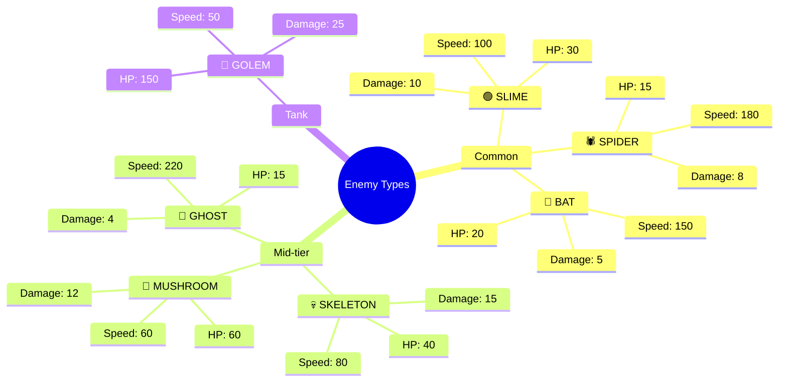
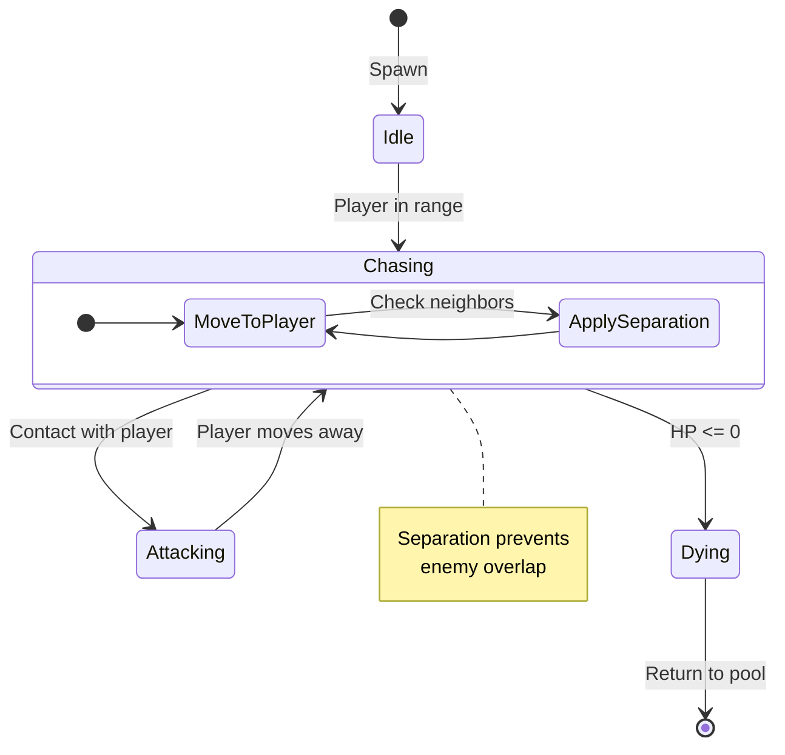
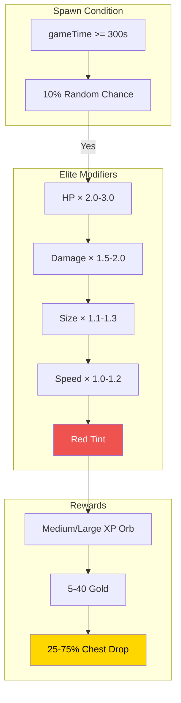
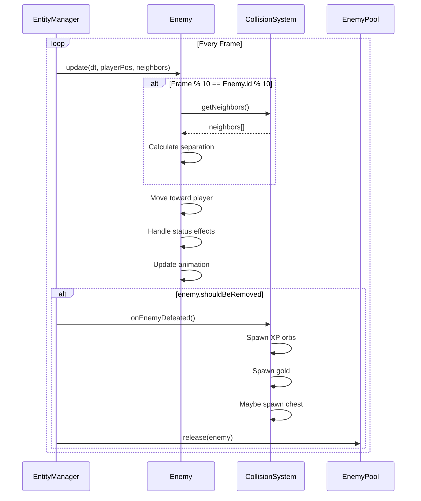
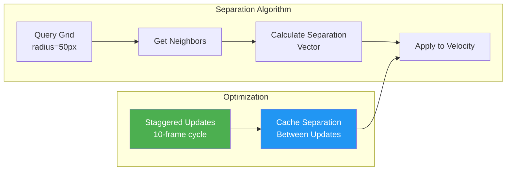
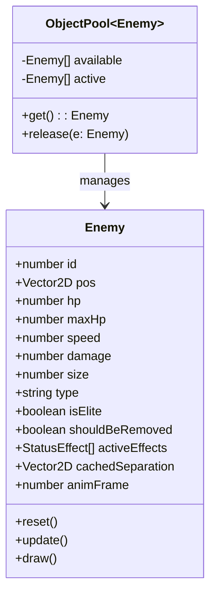

# 👾 Entity & Enemy System

> Complete reference for enemy types, behavior patterns, and entity management.

---

## Enemy Type Gallery

---

## Enemy Behavior FSM

---

## Elite Enemy System

---

## Enemy Stats Comparison Table

| Enemy | HP | Speed | Damage | XP Type | Gold | Elite Chest% |
|-------|-----|-------|--------|---------|------|--------------|
| 🟢 Slime | 30 | 100 | 10 | SMALL | 1-3 | - |
| 🕷️ Spider | 15 | 180 | 8 | SMALL | 1-3 | - |
| 🦇 Bat | 20 | 150 | 5 | SMALL | 1-2 | - |
| 🍄 Mushroom | 60 | 60 | 12 | MEDIUM | 2-5 | - |
| 👻 Ghost | 15 | 220 | 4 | SMALL | 1-2 | - |
| 💀 Skeleton | 40 | 80 | 15 | SMALL | 2-5 | - |
| 🗿 Golem | 150 | 50 | 25 | MEDIUM | 5-10 | 25% |

---

## Entity Update Flow

---

## Flocking Behavior

---

## XP Orb Types

| Type | XP Value | Visual | Source |
|------|----------|--------|--------|
| SMALL | 5 | 💚 Green | Common enemies |
| MEDIUM | 15 | 💙 Blue | Mushroom, Elite basic |
| LARGE | 50 | 💜 Purple | Elite tanks |

---

## Entity Memory Layout

