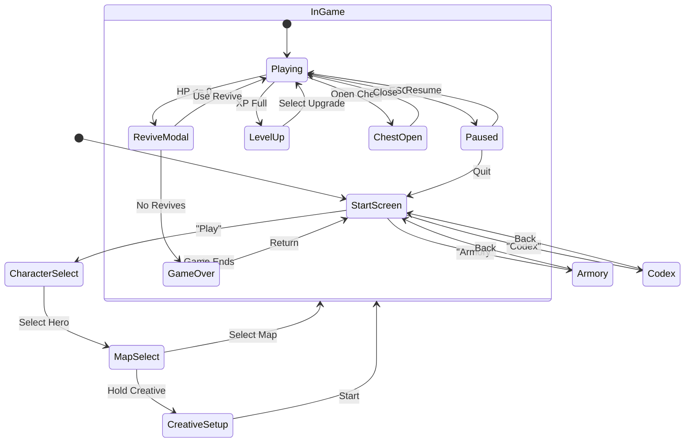
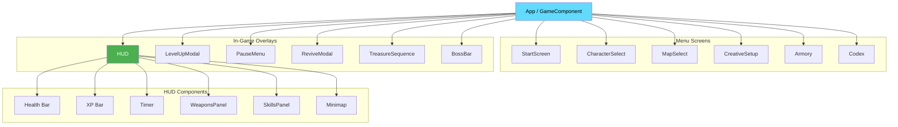
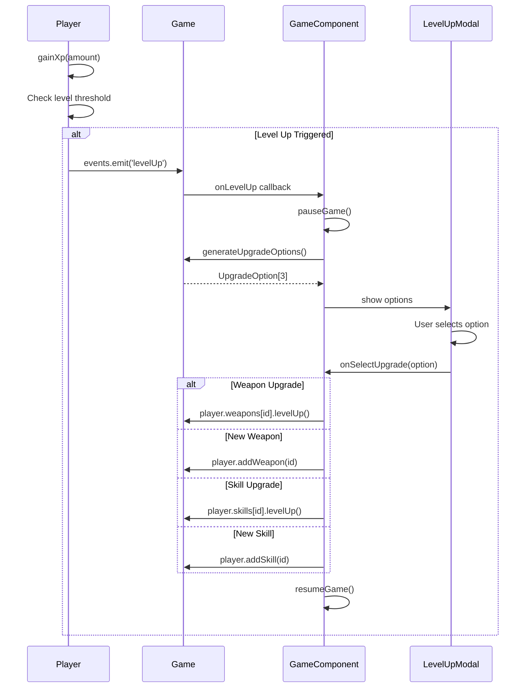
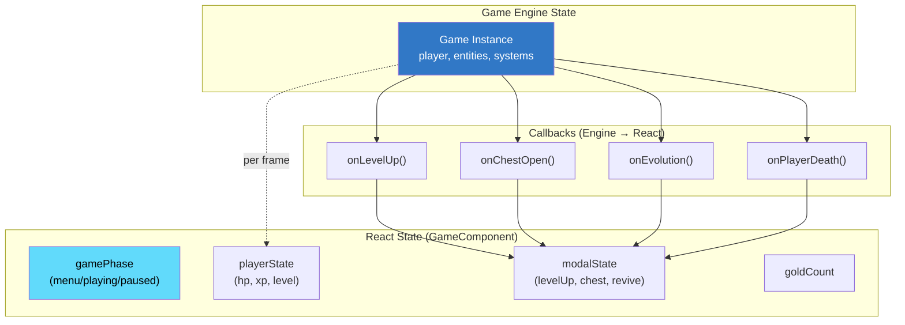

# 🖥️ UI Components & Game Flow

> React component architecture and user interface flow.

---

## Screen Flow State Machine



---

## Component Hierarchy



---

## Level Up Modal Flow



---

## Component Props Reference

| Component | Key Props | State Managed |
|-----------|-----------|---------------|
| `HUD` | `playerState`, `gameTime` | None (stateless) |
| `LevelUpModal` | `options[]`, `rerolls`, `onSelect` | Hover state |
| `CharacterSelect` | `characters[]`, `onSelect` | Selected hero |
| `Armory` | `upgrades[]`, `gold`, `onPurchase` | Purchase status |
| `PauseMenu` | `onResume`, `onQuit` | None |
| `GameOverScreen` | `stats`, `gold`, `onReturn` | None |

---

## State Management Flow



---

## Styling Architecture

```
src/styles/
├── base.css          # Reset, variables, canvas
├── buttons.css       # Jelly/Capsule button styles
├── startScreen.css   # Candy Pop theme
├── gameOver.css      # Death screen
├── hud.css           # In-game overlay
├── menus.css         # Card containers
├── components.css    # Special components
└── animations.css    # @keyframes definitions
```

### CSS Variable Tokens

```css
/* Example from base.css */
:root {
  --color-primary: #ff6b6b;
  --color-secondary: #4ecdc4;
  --color-gold: #ffd700;
  --color-danger: #ff4757;
  --font-game: 'Nunito', sans-serif;
  --transition-fast: 0.15s ease;
}
```
