# 🏆 Progression & Meta Systems

> Permanent upgrades, save system, and roguelite progression mechanics.

---

## Meta-Progression Overview

```mermaid
flowchart TB
    subgraph "Single Run"
        Play["🎮 Play Game"]
        Earn["💰 Earn Gold"]
        Death["💀 Game Over"]
    end

    subgraph "Between Runs"
        Save["💾 Gold Saved"]
        Armory["🏪 Visit Armory"]
        Buy["🛒 Purchase Upgrades"]
    end

    subgraph "Permanent Stats"
        Damage["⚔️ +Damage%"]
        HP["❤️ +Max HP%"]
        Speed["🏃 +Move Speed%"]
        Revival["💫 +Revival"]
    end

    Play --> Earn
    Earn --> Death
    Death --> Save
    Save --> Armory
    Armory --> Buy
    Buy --> Damage
    Buy --> HP
    Buy --> Speed
    Buy --> Revival
    
    Damage --> Play
    HP --> Play
    Speed --> Play
    Revival --> Play

    style Save fill:#ffd700,color:#000
    style Buy fill:#4caf50,color:#fff
```



---

## ProgressionManager Architecture


---

## Armory Upgrade Tree

```mermaid
graph LR
    subgraph "Damage Path"
        D1["⚔️ Damage I<br/>50g - +5%"]
        D2["⚔️ Damage II<br/>100g - +10%"]
        D3["⚔️ Damage III<br/>200g - +15%"]
    end

    subgraph "Survival Path"
        H1["❤️ Health I<br/>50g - +10%"]
        H2["❤️ Health II<br/>100g - +20%"]
        R1["💫 Revival<br/>300g - +1 Life"]
    end

    subgraph "Mobility Path"
        S1["🏃 Speed I<br/>75g - +5%"]
        S2["🏃 Speed II<br/>150g - +10%"]
    end

    D1 --> D2 --> D3
    H1 --> H2 --> R1
    S1 --> S2

    style R1 fill:#d4af37,color:#000
```



---

## XP & Leveling Curve


---

## Save Data Structure

```typescript
interface SaveData {
  gold: number;
  purchasedUpgrades: string[];
  settings: {
    musicVolume: number;
    sfxVolume: number;
    language: 'en' | 'zh-CN';
  };
  stats: {
    totalPlayTime: number;
    totalKills: number;
    highestWave: number;
  };
}
```

---

## Upgrade Application Flow


---

## Run Rewards Calculation

```mermaid
flowchart LR
    subgraph "Gold Sources"
        Enemies["💀 Enemy Kills"]
        Elites["⭐ Elite Kills"]
        Chests["📦 Chests"]
    end

    subgraph "Calculation"
        Base["Base Gold"]
        Time["Time Bonus"]
        Total["Total Gold"]
    end

    subgraph "Persistence"
        Save["LocalStorage"]
        Armory["Armory Available"]
    end

    Enemies --> Base
    Elites --> Base
    Chests --> Base
    Base --> Time
    Time --> Total
    Total --> Save
    Save --> Armory

    style Total fill:#ffd700,color:#000
```



---

## Chest Reward System

| Rarity | XP Drop | Gold | Upgrade Chance |
|--------|---------|------|----------------|
| Normal | 25+ | 10-25 | 50% |
| Elite | 50+ | 25-50 | 75% |
| Boss | 100+ | 50-100 | 100% |

---

## Evolution System

```mermaid
graph TB
    subgraph "Recipe Requirements"
        Base["🔫 Base Weapon<br/>Max Level (9)"]
        Catalyst["💎 Catalyst Skill<br/>Required Level"]
    end

    subgraph "Evolution Check"
        Check{Both<br/>Conditions<br/>Met?}
    end

    subgraph "Result"
        Evolve["✨ Weapon Evolution!"]
        Replace["Old → New Weapon"]
        Notify["UI Notification"]
    end

    Base --> Check
    Catalyst --> Check
    Check -->|Yes| Evolve
    Evolve --> Replace
    Replace --> Notify

    style Evolve fill:#d4af37,color:#000
```



### Example Evolutions

| Base Weapon | Catalyst | Evolved Weapon |
|-------------|----------|----------------|
| 🔫 Bullet (Lv9) | 💨 Swiftness | 🦾 Gatling Gun |
| 🥏 Boomerang (Lv9) | ❤️ Toughness | 💿 Sonic Disc |
| 🔥 Sunfire (Lv9) | 💥 Energy Pulse | 🌞 Supernova |
