# 🔄 进化配方设计文档

> Sparkle Survivors v2.0 进化系统扩展
> 版本: 1.0 | 作者: AI Game Designer | 日期: 2026-01-06

---

## 📋 概述

本文档定义了完整的武器进化配方，包括现有进化和新增进化。

---

## 🗺️ 进化关系图

```mermaid
flowchart TD
    subgraph "投射物线"
        BULLET[🔫 BULLET] -->|+ TOUGHNESS| GATLING[🦾 GATLING_GUN]
        GATLING -->|+ SWIFTNESS| DOOM[👹 DOOM_CANNON]
    end

    subgraph "回旋线"
        BOOMERANG[🥏 BOOMERANG] -->|+ SWIFTNESS| SONIC[💿 SONIC_DISC]
        SONIC -->|+ TOUGHNESS| VOID[🌌 VOID_EATER]
    end

    subgraph "光环线"
        SUNFIRE[🔥 SUNFIRE] -->|+ REGENERATION| SUPERNOVA[🌞 SUPERNOVA]
        SUPERNOVA -->|+ REGENERATION| BLACK_HOLE[🕳️ BLACK_HOLE]
    end

    subgraph "毒系线 (NEW)"
        POISON[🗡️ POISON_DAGGER] -->|+ TOUGHNESS| VENOM[🐍 VENOM_FANG]
        VENOM -->|+ REGENERATION| PLAGUE[☠️ PLAGUE_SCYTHE]
    end

    subgraph "召唤线 (NEW)"
        SPIRIT[👻 SPIRIT_ORB] -->|+ HOLY_NOVA| PHANTOM[👁️ PHANTOM_GUARD]
        PHANTOM -->|+ MOMENTUM| SOUL[🌀 SOUL_VORTEX]
    end

    subgraph "链式线 (NEW)"
        CHAIN[⛓️ CHAIN_BOLT] -->|+ ELEMENTAL_MASTERY| SHOCK[⚡ SHOCK_CHAIN]
        SHOCK -->|+ CRITICAL_STRIKE| STORM[🌩️ STORM_WEAVER]
    end

    subgraph "陷阱线 (NEW)"
        SPIKE[📌 SPIKE_TRAP] -->|+ SWIFTNESS| FROST_MINE[💎 FROST_MINE]
        FROST_MINE -->|+ TOUGHNESS| VOID_RIFT[🌑 VOID_RIFT]
    end

    subgraph "独立武器进化 (NEW)"
        ICE_SHARD[❄️ ICE_SHARD] -->|+ ELEMENTAL_MASTERY| FROST_STORM[🌨️ FROST_STORM]
        MAGIC_MISSILE[🔮 MAGIC_MISSILE] -->|+ BALLISTICS| ARCANE_SWARM[💫 ARCANE_SWARM]
        THUNDER_STAFF[⚡ THUNDER_STAFF] -->|+ ELEMENTAL_MASTERY| CHAIN_LIGHTNING[🌩️ CHAIN_LIGHTNING]
        KATANA[🗡️ KATANA] -->|+ SWIFTNESS| SHADOW_BLADE[⚔️ SHADOW_BLADE]
    end

    style DOOM fill:#ff5722,color:#fff
    style VOID fill:#7c4dff,color:#fff
    style BLACK_HOLE fill:#212121,color:#fff
    style PLAGUE fill:#4caf50,color:#fff
    style SOUL fill:#9c27b0,color:#fff
    style STORM fill:#ffc107,color:#000
    style VOID_RIFT fill:#311b92,color:#fff
```



---

## 📝 进化配方数据

### 现有进化 (保持不变)

```typescript
// Tier 1 -> Tier 2
{ baseWeaponId: 'BULLET', requiredSkillId: 'TOUGHNESS', evolvedWeaponId: 'GATLING_GUN' },
{ baseWeaponId: 'BOOMERANG', requiredSkillId: 'SWIFTNESS', evolvedWeaponId: 'SONIC_DISC' },
{ baseWeaponId: 'SUNFIRE', requiredSkillId: 'REGENERATION', evolvedWeaponId: 'SUPERNOVA' },

// Tier 2 -> Tier 3
{ baseWeaponId: 'GATLING_GUN', requiredSkillId: 'SWIFTNESS', evolvedWeaponId: 'DOOM_CANNON' },
{ baseWeaponId: 'SONIC_DISC', requiredSkillId: 'TOUGHNESS', evolvedWeaponId: 'VOID_EATER' },
{ baseWeaponId: 'SUPERNOVA', requiredSkillId: 'REGENERATION', evolvedWeaponId: 'BLACK_HOLE' },
```

### 新增进化 - 毒系线

```typescript
{ baseWeaponId: 'POISON_DAGGER', requiredSkillId: 'TOUGHNESS', evolvedWeaponId: 'VENOM_FANG' },
{ baseWeaponId: 'VENOM_FANG', requiredSkillId: 'REGENERATION', evolvedWeaponId: 'PLAGUE_SCYTHE' },
```

### 新增进化 - 召唤线

```typescript
{ baseWeaponId: 'SPIRIT_ORB', requiredSkillId: 'HOLY_NOVA', evolvedWeaponId: 'PHANTOM_GUARD' },
{ baseWeaponId: 'PHANTOM_GUARD', requiredSkillId: 'MOMENTUM', evolvedWeaponId: 'SOUL_VORTEX' },
```

### 新增进化 - 链式线

```typescript
{ baseWeaponId: 'CHAIN_BOLT', requiredSkillId: 'ELEMENTAL_MASTERY', evolvedWeaponId: 'SHOCK_CHAIN' },
{ baseWeaponId: 'SHOCK_CHAIN', requiredSkillId: 'CRITICAL_STRIKE', evolvedWeaponId: 'STORM_WEAVER' },
```

### 新增进化 - 陷阱线

```typescript
{ baseWeaponId: 'SPIKE_TRAP', requiredSkillId: 'SWIFTNESS', evolvedWeaponId: 'FROST_MINE' },
{ baseWeaponId: 'FROST_MINE', requiredSkillId: 'TOUGHNESS', evolvedWeaponId: 'VOID_RIFT' },
```

### 新增进化 - 独立武器

```typescript
// 现有独立武器获得进化路径
{ baseWeaponId: 'ICE_SHARD', requiredSkillId: 'ELEMENTAL_MASTERY', evolvedWeaponId: 'FROST_STORM' },
{ baseWeaponId: 'MAGIC_MISSILE', requiredSkillId: 'BALLISTICS', evolvedWeaponId: 'ARCANE_SWARM' },
{ baseWeaponId: 'THUNDER_STAFF', requiredSkillId: 'ELEMENTAL_MASTERY', evolvedWeaponId: 'CHAIN_LIGHTNING' },
{ baseWeaponId: 'KATANA', requiredSkillId: 'SWIFTNESS', evolvedWeaponId: 'SHADOW_BLADE' },
```

---

## 🆕 新进化武器数据

### FROST_STORM 霜暴 (ICE_SHARD T2)

| 属性 | 数值 |
|------|------|
| **ID** | `FROST_STORM` |
| **图标** | 🌨️ |
| **类型** | LASER |
| **伤害** | 30 |
| **冷却** | 800ms |
| **范围** | 800px |
| **特殊** | 发射 3 道激光 (前 + 左右45°) |
| **状态效果** | SLOW 70% 3秒 + FREEZE 5%几率冻结1秒 |

---

### ARCANE_SWARM 奥术蜂群 (MAGIC_MISSILE T2)

| 属性 | 数值 |
|------|------|
| **ID** | `ARCANE_SWARM` |
| **图标** | 💫 |
| **类型** | HOMING_PROJECTILE |
| **伤害** | 25 |
| **冷却** | 800ms |
| **发射数** | 5 发同时发射 |
| **穿透** | 2 |

---

### CHAIN_LIGHTNING 连锁闪电 (THUNDER_STAFF T2)

| 属性 | 数值 |
|------|------|
| **ID** | `CHAIN_LIGHTNING` |
| **图标** | 🌩️ |
| **类型** | LIGHTNING |
| **伤害** | 80 |
| **冷却** | 2000ms |
| **目标数** | 5 (链式传导) |
| **爆炸半径** | 150px |

---

### SHADOW_BLADE 暗影之刃 (KATANA T2)

| 属性 | 数值 |
|------|------|
| **ID** | `SHADOW_BLADE` |
| **图标** | ⚔️ |
| **类型** | MELEE |
| **伤害** | 90 |
| **冷却** | 800ms |
| **范围** | 120px |
| **特殊** | 攻击时留下暗影残影，残影 0.5 秒后再次攻击 (50%伤害) |

---

## 📊 进化条件统计

### 技能使用频率
| 技能 | 被使用次数 | 相关进化 |
|------|------------|----------|
| TOUGHNESS | 4 | GATLING, VENOM, VOID_EATER, VOID_RIFT |
| SWIFTNESS | 4 | SONIC, DOOM, FROST_MINE, SHADOW_BLADE |
| REGENERATION | 3 | SUPERNOVA, BLACK_HOLE, PLAGUE |
| ELEMENTAL_MASTERY | 3 | SHOCK, FROST_STORM, CHAIN_LIGHTNING |
| BALLISTICS | 1 | ARCANE_SWARM |
| HOLY_NOVA | 1 | PHANTOM_GUARD |
| MOMENTUM | 1 | SOUL_VORTEX |
| CRITICAL_STRIKE | 1 | STORM_WEAVER |

### 新技能进化价值
新技能 `MOMENTUM` 和 `CRITICAL_STRIKE` 被设计为高级进化所需，鼓励玩家解锁新技能。

---

## 🎮 角色起始武器建议

| 角色 | 当前起始武器 | 建议新增可选 |
|------|--------------|--------------|
| KNIGHT | BULLET | POISON_DAGGER (近战适配) |
| ROGUE | BOOMERANG | CHAIN_BOLT (快速风格) |
| MAGE | SUNFIRE | SPIRIT_ORB (召唤流) |
| CLERIC | MAGIC_MISSILE | 保持不变 |
| HUNTRESS | BOOMERANG | SPIKE_TRAP (控制流) |
| WARLOCK | ICE_SHARD | SPIRIT_ORB (召唤流) |

---

## ✅ 开发 Checklist

- [ ] 更新 `evolutionData.ts` 添加新进化配方
- [ ] 实现 FROST_STORM 三向激光
- [ ] 实现 ARCANE_SWARM 多发追踪弹
- [ ] 实现 CHAIN_LIGHTNING 链式闪电
- [ ] 实现 SHADOW_BLADE 残影机制
- [ ] 更新进化触发逻辑验证新技能
